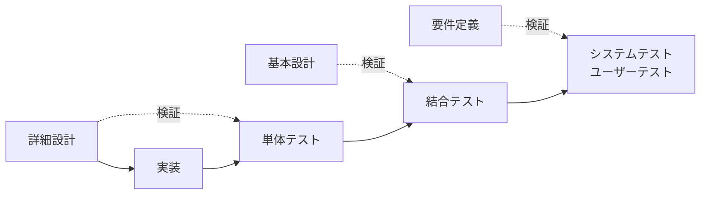

# GUオンラインストア テスト仕様書

## 目次

- 1. 本書の位置づけ
  - 1.1 一連の文書における位置
  - 1.2 V字モデルにおける対応
  - 1.3 対象範囲
- 2. テスト方針
  - 2.1 層ごとの比重
  - 2.2 単体テストの対象
  - 2.3 結合テストの対象
  - 2.4 ユーザーテストの対象
  - 2.5 テスト観点と設計技法
  - 2.6 組み合わせの絞り込み
  - 2.7 期待値の決定
  - 2.8 テストの実施環境
- 3. テストケースの記述形式
- 4. 単体テスト
  - 4.1 対象と方針
  - 4.2 Stock
  - 4.3 Reservation
  - 4.4 PriceCalculator
  - 4.5 PaymentMethodPolicy
  - 4.6 Alteration
- 5. 結合テスト
  - 5.1 検証の方法
  - 5.2 同一SKUへの同時カート投入（P0）
  - 5.3 注文確定・決済成功（P0）
  - 5.4 注文確定・決済失敗（P0）
  - 5.5 決済のタイムアウト（P0）
  - 5.6 注文確定の二重送信（P0）
  - 5.7 引当期限切れ後の注文（P1）
  - 5.8 未ログインカートの統合（P1）
  - 5.9 他人のカートを指定した注文（P1）
- 6. ユーザーテスト
  - 6.1 方針
  - 6.2 正常系
  - 6.3 異常系
  - 6.4 本章で確認しない事項
- 7. 濫用・改ざん観点
  - 7.1 本章の位置づけ
  - 7.2 入力値の検証を回避する
  - 7.3 金額の改ざん
  - 7.4 選択肢の制約の回避
  - 7.5 認証・認可の回避
  - 7.6 認証情報の露出
  - 7.7 セッションの操作
  - 7.8 並行した操作
  - 7.9 仕様の範囲内で行われる濫用
  - 7.10 本章の結果の扱い
- 8. テスト実施環境
  - 8.1 方針
  - 8.2 決済代行事業者のスタブ
  - 8.3 DB
  - 8.4 時刻
  - 8.5 環境の一覧
- 9. 期待値未確定事項
  - 9.1 本章の位置づけ
  - 9.2 一覧
  - 9.3 各項目の詳細
  - 9.4 優先して決定すべき事項
  - 9.5 TBD として期待値を設定しない事項
- 10. 本書の作成により設計へ反映した事項
  - 10.1 本章の位置づけ
  - 10.2 誤りとして修正した事項
  - 10.3 不足として追加した事項
  - 10.4 テスト設計の位置づけ
  - 10.5 生成AIの利用について
  - 10.6 外部のレビューにより追加した事項

## 1. 本書の位置づけ

### 1.1 一連の文書における位置

本書は、要件定義書および設計仕様書で定めた内容が満たされているかを検証するための
テストを定義する。

| 文書 | 答える問い |
|---|---|
| 要件定義書 | システムは何を満たすべきか |
| 設計仕様書 | それをどう実現するか |
| 本書（テスト仕様書） | それが満たされているかをどう確かめるか |

### 1.2 V字モデルにおける対応

開発の各工程で決定した内容を、対応するテスト工程で検証する。



本書における対応は以下のとおりである。

| テストの層 | 検証の対象 | 参照する識別子 |
|---|---|---|
| 単体テスト | 個々のクラスが担う判断 | DS-（設計仕様書） |
| 結合テスト | コンポーネント間の連携、状態の整合 | DS-（設計仕様書） |
| ユーザーテスト | 顧客から見た振る舞い、表示義務 | FR-（要件定義書） |

各テストケースには、検証の根拠となる識別子を付す。これにより、要件および設計から
テストへの追跡が可能となる。

### 1.3 対象範囲

設計仕様書 2章において定めた①の範囲を対象とする。

```
商品詳細（SKU選択・すそ上げの選択）
  → カート投入（在庫の引当・60分）
  → ログイン
  → 配送方法・支払方法の選択
  → 注文確定（引当の確定・決済）
```

②（店舗POS、ORDER & PICK）は対象外とする。

## 2. テスト方針

### 2.1 層ごとの比重

| 層 | 比重 | 理由 |
|---|---|---|
| 単体テスト | 35% | 条件分岐が複雑で、単体で検出できる誤りを対象とする |
| 結合テスト | **50%** | 本設計における主要なリスクが、コンポーネントの境界に集中している |
| ユーザーテスト | 15% | 表示義務および顧客から見た振る舞いに絞る |

**一般的なテストピラミッドの比率（単体70%／結合20%／E2E 10%）から意図的に外している。**

理由は、本設計における主要なリスクの所在にある。

| リスク | 発生箇所 |
|---|---|
| 二重販売 | 在庫DB × トランザクション（排他制御） |
| 代金だけ受領し商品を渡さない | DB × 決済代行事業者 |
| 決済の結果が不明なまま在庫を戻す | 外部サービスの応答 × 補償処理 |
| 金額の改ざん | Frontend × Backend |
| 他人の注文への到達 | 認証 × 認可 |

いずれも、**単一のクラスの内部では発生しない。** 複数の要素が関わる境界で生じる。
単体テストをいくら積み上げても、これらは検出できない。

たとえば、決済処理を担う OrderService について、外部への依存をすべて模擬した単体
テストを多数作成することは可能である。しかしそれは「設計したとおりに呼び出しが
行われたか」を確認するに留まり、「代金を受領したが在庫が減っていない」という事象を
検出しない。

### 2.2 単体テストの対象

設計仕様書 8.3.2 のクラス図に示したクラスのうち、以下を対象とする。

| 優先 | 対象 | 選定の理由 |
|---|---|---|
| 1 | Stock | 引当可能数の算出。誤ると売越しまたは販売機会の損失に直結する |
| 2 | Reservation | 60分の時間境界と3つの状態を持つ。境界の判定は誤りやすい |
| 3 | PriceCalculator | 顧客に請求する金額そのもの。送料・手数料・加工料・税・無料境界が集中する |
| 4 | PaymentMethodPolicy | 配送方法 × 置き配 × 支払方法の組み合わせ。条件の追加により誤りが生じやすい |
| 5 | Alteration | 加工方法と丈の依存関係、丈の境界、加工の可否 |

**選定の基準は「壊れたときの影響」と「誤りの起きやすさ」である。** テストの実施が
容易であることは基準としない。

以下は単体テストの対象から外す。

| 対象 | 理由 |
|---|---|
| Cart / CartItem | 統合の条件は複雑だが、本質は複数の状態にまたがる処理であり、結合テストで扱う |
| Order / OrderItem | 注文時点の値を保持する役割。結合テストにおいて確認する |
| Member | 認証は簡略化した実装であり（設計仕様書 1.2）、②以降で外部基盤へ置き換える |
| ReservationService | 本質は DB のロックとトランザクション。結合テストで扱う |
| OrderService | 本質は DB と決済代行事業者を含む一連の処理。結合テストで扱う |

ReservationService および OrderService は、システム全体としては最も重要である。
単体テストの対象としないのは、重要でないためではなく、**単体テストでは本質的な
リスクを検出できないためである。**

### 2.3 結合テストの対象

購入フローのうち、以下の8経路を対象とする。

| 優先 | 経路 | 確認する内容 |
|---|---|---|
| P0 | 同一SKUへの同時カート投入 | 在庫1点に対し、2件の要求がともに成功しない |
| P0 | 注文確定（決済成功） | 引当 → 在庫減算 → 決済 → 確定 → カート削除 |
| P0 | 注文確定（決済失敗） | 在庫の復元、引当の解放、カートの維持 |
| P0 | 決済のタイムアウト | 失敗として扱わず、在庫を戻さない |
| P0 | 注文確定の二重送信 | 注文・決済・在庫減算がいずれも1回のみ |
| P1 | 引当期限切れ後の注文 | 在庫があれば成立し、なければ409を返す |
| P1 | 未ログインカートの統合 | 明細の移動、期限の非延長、合算しないこと |
| P1 | 他人のカートを指定した注文 | 404を返す |

P0 は、失敗した場合に顧客または事業者が回復不能な不利益を負う経路である。

### 2.4 ユーザーテストの対象

顧客の操作として、正常系4本・異常系6本を対象とする。

内部の構造やHTTPステータスコードを意識せず、**顧客から見て「買える／買えない／金額が
分かる／次に何をすればよいか分かる」**を確認する。

特に、表示義務（設計仕様書 4.3.5、DS-437、DS-438）が画面上で満たされているかを確認
する。これは他の層では検証できない。

### 2.5 テスト観点と設計技法

テストケースは、**観点**（何を確かめるか）と**技法**（どの値で確かめるか）の組み合わせ
により作成する。

**観点**

| 層 | 観点 |
|---|---|
| 単体 | 正常系（戻り値・状態変化が仕様どおりか）、異常系（異常値・例外）、制御フロー（分岐の網羅） |
| 結合 | インターフェース（データの受け渡し）、状態遷移、外部連携（DB・外部API、エラーの伝播） |

単体で確認した観点は、結合では実行しない。

**技法**

| 技法 | 内容 | 主な適用先 |
|---|---|---|
| 同値分割法 | 同じ結果となる範囲から代表値を1つ選ぶ | 全般 |
| 境界値分析 | 境界とその前後を選ぶ | PriceCalculator、Reservation、Alteration |
| デシジョンテーブル | 複数条件の組み合わせを整理する | PaymentMethodPolicy、Alteration |
| 状態遷移テスト | 状態 × イベントを網羅する | Reservation、結合テスト |
| エラー推測 | 壊れそうな入力を狙う | 全般 |

### 2.6 組み合わせの絞り込み

条件の組み合わせをすべて網羅すると、ケース数が現実的でない規模となる。以下により
絞り込む。

| 手法 | 内容 |
|---|---|
| 単一障害仮説 | 1つのケースに含める異常値を1つに限る。複数の異常値を同時に与えない |
| ペアワイズ | 因子が3つ以上のとき、2因子間の全ペアのみを網羅する |

**単一障害仮説を採る理由**

異常値を2つ同時に与えると、どちらが原因で異常となったかを判別できない。また、最初の
検証で処理が中断するため、2つ目の異常値は検証されない。

**ペアワイズを採る理由**

支払方法（5種）× 配送方法（3種）× 置き配（8種）の全組み合わせは120通りとなる。
実際の不具合の多くは2つの因子の組み合わせにより生じるため、2因子間のペアを網羅すれば
大半を検出できる。

### 2.7 期待値の決定

**期待値は本書の作成者が決定する。**

テストケースの作成には生成AIを用いるが、期待値の決定を委ねない。AIに推測させた場合、
「現在の設計または実装が正しい」という前提のテストとなり、設計自体の誤りを検出でき
ないためである。

設計仕様書に記述がなく、期待値を一意に決定できない箇所については、8章において
「期待値未確定事項」として記録する。

### 2.8 テストの実施環境

外部への依存を含む経路について、異常を意図的に発生させる手段を定める。詳細は7章に
記述する。

## 3. テストケースの記述形式

各テストケースは以下の形式で記述する。

| 項目 | 内容 |
|---|---|
| ID | TC-（層）-（対象）-（連番） |
| 観点 | 正常系／異常系／制御フロー／状態遷移／外部連携 |
| 技法 | 同値分割／境界値分析／デシジョンテーブル／状態遷移テスト／エラー推測 |
| 入力 | 与える値または操作 |
| 期待値 | 期待する結果 |
| 根拠 | FR- または DS- の識別子 |

IDの体系は以下とする。

| 接頭辞 | 層 |
|---|---|
| TC-UT- | 単体テスト（Unit Test） |
| TC-IT- | 結合テスト（Integration Test） |
| TC-UAT- | ユーザーテスト（User Acceptance Test） |
| TC-AB- | 濫用・改ざん観点（Abuse） |

## 4. 単体テスト

### 4.1 対象と方針

| 対象 | 検証する責務 | 主な技法 |
|---|---|---|
| Stock | 引当可能数の算出 | 同値分割、境界値分析、状態遷移 |
| Reservation | 引当の有効性の判定、状態遷移 | 境界値分析、状態遷移テスト |
| PriceCalculator | 金額の算出 | 境界値分析、デシジョンテーブル |
| PaymentMethodPolicy | 支払方法の可否判定 | デシジョンテーブル |
| Alteration | すそ上げ指定の検証 | デシジョンテーブル、境界値分析 |

いずれも DB および外部サービスへの依存を持たない。引数を与えて戻り値を検証する形式
とする。

### 4.2 Stock

#### 4.2.1 対象

| メソッド | 内容 |
|---|---|
| availableQuantity(reservations) | 引当可能数を算出する |
| canReserve(qty, reservations) | 指定数量の引当が可能かを判定する |

算出式は以下による（設計仕様書 3.4.3）。

```
引当可能数 = quantity - SUM(ACTIVE かつ expires_at > now の reservation.quantity)
```

#### 4.2.2 テストケース

| ID | 観点 | 技法 | 入力 | 期待値 | 根拠 |
|---|---|---|---|---|---|
| TC-UT-ST-01 | 正常系 | 同値分割 | 在庫10、引当なし | 10 | DS-341 |
| TC-UT-ST-02 | 正常系 | 同値分割 | 在庫10、ACTIVE 3（期限内） | 7 | DS-341 |
| TC-UT-ST-03 | 正常系 | 状態遷移 | 在庫10、RELEASED 3 | 10 | DS-341 |
| TC-UT-ST-04 | 正常系 | 状態遷移 | 在庫9、CONFIRMED 1 | **9** | DS-341 |
| TC-UT-ST-05 | 正常系 | 状態遷移 | 在庫10、ACTIVE 2・CONFIRMED 3・RELEASED 1 | 8 | DS-341 |
| TC-UT-ST-06 | 境界値 | 境界値分析 | 在庫10、ACTIVE 10 | 0 | — |
| TC-UT-ST-07 | 境界値 | 境界値分析 | 在庫0、引当なし | 0 | — |
| TC-UT-ST-08 | 境界値 | 境界値分析 | 引当可能数5、要求5 | true | — |
| TC-UT-ST-09 | 境界値 | 境界値分析 | 引当可能数5、要求6 | false | — |
| TC-UT-ST-10 | 境界値 | 境界値分析 | 引当可能数5、要求4 | true | — |
| TC-UT-ST-11 | 期限 | 境界値分析 | ACTIVE、expires_at が現在時刻の1秒前 | 減算しない | DS-341 |
| TC-UT-ST-12 | 期限 | 境界値分析 | ACTIVE、expires_at が現在時刻と一致 | **減算しない** | DS-341 |
| TC-UT-ST-13 | 期限 | 境界値分析 | ACTIVE、expires_at が現在時刻の1秒後 | 減算する | DS-341 |
| TC-UT-ST-14 | 異常系 | エラー推測 | 在庫が -2 | **例外（DataIntegrityException）** | DS-322 |
| TC-UT-ST-15 | 異常系 | エラー推測 | 要求数量 0 | 【未確定1】 | — |
| TC-UT-ST-16 | 異常系 | エラー推測 | 要求数量 -1 | 【未確定1】 | — |

**TC-UT-ST-04 について**

本ケースは、設計上の誤りを検出するために置く。

当初の設計では、引当可能数の算出において CONFIRMED も減算していた。この場合、注文
確定により在庫を減算したうえで、さらに CONFIRMED を減算するため、同一の数量を二重に
差し引くことになる。

```
在庫10 → 1点をカート投入（ACTIVE 1）→ 引当可能 9
       → 注文確定（在庫9、CONFIRMED 1）→ 引当可能 8（誤）／9（正）
```

CONFIRMED の行を残す設計であるため、この誤差は確定した注文の数だけ累積する。

本ケースの期待値は **9** である。8 が返る場合、設計または実装のいずれかに誤りがある。

**TC-UT-ST-12 について**

expires_at と現在時刻が完全に一致する場合の扱い。算出式が `expires_at > now` である
ため、一致する場合は条件を満たさず、減算しない。すなわち引当は無効となる。

#### 4.2.3 悪用の観点

| ID | 観点 | 入力 | 期待値 |
|---|---|---|---|
| TC-UT-ST-20 | エラー推測 | 要求数量に巨大な整数（10^18） | false。桁あふれを起こさない |
| TC-UT-ST-21 | エラー推測 | reservations に同一IDの重複 | 【未確定2】 |

### 4.3 Reservation

#### 4.3.1 対象

| メソッド | 内容 |
|---|---|
| isActive(now) | 引当が有効かを判定する |
| confirm() | CONFIRMED へ遷移させる |
| release() | RELEASED へ遷移させる |

有効の条件は `status = ACTIVE かつ expires_at > now` である。

#### 4.3.2 有効性の判定

引当の期限は、カート投入から60分とする（設計仕様書 3.3.5）。

| ID | 観点 | 技法 | 入力（経過時間） | 期待値 | 根拠 |
|---|---|---|---|---|---|
| TC-UT-RS-01 | 正常系 | 同値分割 | 30分00秒 | true | FR-561-02 |
| TC-UT-RS-02 | 境界値 | 境界値分析 | 59分59秒 | true | FR-561-02 |
| TC-UT-RS-03 | 境界値 | 境界値分析 | **60分00秒（完全一致）** | **false** | FR-561-02 |
| TC-UT-RS-04 | 境界値 | 境界値分析 | 60分01秒 | false | FR-561-02 |
| TC-UT-RS-05 | 境界値 | 境界値分析 | 0秒（投入直後） | true | — |
| TC-UT-RS-06 | 状態 | 状態遷移 | status = CONFIRMED（期限内） | false | — |
| TC-UT-RS-07 | 状態 | 状態遷移 | status = RELEASED（期限内） | false | — |
| TC-UT-RS-08 | 異常系 | エラー推測 | status = ACTIVE、expires_at が null | 【未確定3】 | — |

**TC-UT-RS-03 について**

算出式が `expires_at > now` であるため、完全に一致する場合は false となる。

この1秒の差が実務上の問題を生じることはないが、**期待値を明示しないと実装により
挙動が分かれる。** 本ケースにより、境界の扱いを固定する。

#### 4.3.3 状態遷移

設計仕様書 3.3.5 に定めた遷移の可否を検証する。

| 現在の状態 | confirm() | release() |
|---|---|---|
| ACTIVE | CONFIRMED へ遷移 | RELEASED へ遷移 |
| CONFIRMED | **例外** | **例外** |
| RELEASED | **例外** | **何もしない（冪等）** |

| ID | 観点 | 技法 | 入力 | 期待値 | 根拠 |
|---|---|---|---|---|---|
| TC-UT-RS-10 | 状態遷移 | 状態遷移テスト | ACTIVE に confirm() | CONFIRMED へ遷移 | DS-331 |
| TC-UT-RS-11 | 状態遷移 | 状態遷移テスト | ACTIVE に release() | RELEASED へ遷移 | DS-332 |
| TC-UT-RS-12 | 異常系 | 状態遷移テスト | CONFIRMED に confirm() | **例外。状態は CONFIRMED のまま** | DS-331 |
| TC-UT-RS-13 | 異常系 | 状態遷移テスト | RELEASED に confirm() | **例外。状態は RELEASED のまま** | DS-331 |
| TC-UT-RS-14 | 異常系 | 状態遷移テスト | CONFIRMED に release() | **例外。状態は CONFIRMED のまま** | DS-333 |
| TC-UT-RS-15 | 正常系 | 状態遷移テスト | RELEASED に release() | **何もしない。例外を発生させない** | DS-332 |

**TC-UT-RS-13 と TC-UT-RS-15 の差について**

同じ「すでにその状態である」場合でも、confirm() と release() で扱いを分ける。

| | 呼び出し元 | 再実行の可能性 | 扱い |
|---|---|---|---|
| confirm() | 注文確定 | なし | 例外 |
| release() | 期限切れの解放処理 | **あり** | 冪等 |

解放処理は失敗時に再実行されうる（設計仕様書 3.4.4）。すでに RELEASED のものに対して
release() が呼ばれることは、正常な事象として生じる。ここで例外を発生させると、処理が
停止する。

一方、confirm() が RELEASED に対して呼ばれるのは、在庫を確保していない状態で注文を
確定しようとしていることを意味する。処理を止める必要がある。

**TC-UT-RS-12 から TC-UT-RS-14 において、状態が変化しないことを併せて検証する。**
例外を発生させたうえで状態を変更していると、呼び出し側が例外を捕捉した場合に不整合が
残る。

#### 4.3.4 悪用の観点

| ID | 観点 | 入力 | 期待値 |
|---|---|---|---|
| TC-UT-RS-20 | エラー推測 | isActive(now) に未来の時刻を渡す | 期限より後なら false |
| TC-UT-RS-21 | エラー推測 | confirm() を連続して2回呼ぶ | 1回目成功、2回目は例外 |

### 4.4 PriceCalculator

#### 4.4.1 前提とする数値

| 項目 | 値 | 根拠 |
|---|---|---|
| 送料無料の基準額 | 税抜5,000円以上 | FR-561-20、FR-561-21 |
| 送料（指定住所受取り） | 500円 | 5.6.2.1 |
| 送料（ネコポス） | 200円 | 5.6.2.1 |
| 送料（店舗受取り） | 0円（金額を問わない） | FR-561-22 |
| 手数料（後払い） | 250円 | 5.6.3.1 |
| 手数料（代金引換え） | 330円 | 5.6.3.1 |
| 手数料（その他） | 0円 | 5.6.3.1 |
| すそ上げ加工料 | 300〜560円（加工方法による） | 5.6.4.1 |
| 消費税 | 10%。注文単位で1回、1円未満切り捨て | DS-391〜393 |

#### 4.4.2 送料の境界値

| ID | 観点 | 技法 | 入力（商品合計・税抜） | 期待値（送料） | 根拠 |
|---|---|---|---|---|---|
| TC-UT-PC-01 | 境界値 | 境界値分析 | 4,999円（指定住所） | 500円 | FR-561-20 |
| TC-UT-PC-02 | 境界値 | 境界値分析 | **5,000円（指定住所）** | **0円** | FR-561-20 |
| TC-UT-PC-03 | 境界値 | 境界値分析 | 5,001円（指定住所） | 0円 | FR-561-20 |
| TC-UT-PC-04 | 境界値 | 境界値分析 | 4,999円（ネコポス） | 200円 | FR-561-20 |
| TC-UT-PC-05 | 境界値 | 境界値分析 | 5,000円（ネコポス） | 0円 | FR-561-20 |
| TC-UT-PC-06 | 正常系 | 同値分割 | 1円（店舗受取り） | 0円 | FR-561-22 |
| TC-UT-PC-07 | 正常系 | 同値分割 | 100,000円（店舗受取り） | 0円 | FR-561-22 |
| TC-UT-PC-08 | 境界値 | 境界値分析 | 商品4,800円 + 加工料300円 | **送料500円**（商品のみで判定） | 本書にて決定 |
| TC-UT-PC-09 | 境界値 | 境界値分析 | 商品5,000円 + 加工料300円 | 送料0円 | 本書にて決定 |

**送料無料の判定に用いる金額**

判定は**商品合計（税抜）のみ**による。すそ上げ加工料、支払手数料は含めない。

加工料を含めると、商品以外の費用により送料が無料となる。送料の負担を免れるために加工を
追加するという行動を誘発しうる。

顧客から見ると、支払う総額が5,100円であるのに送料が発生することになる。判定の基準が
商品合計である旨を明示する必要がある（FR-561-23）。

#### 4.4.3 支払手数料

| ID | 観点 | 技法 | 入力（支払方法） | 期待値 | 根拠 |
|---|---|---|---|---|---|
| TC-UT-PC-10 | 正常系 | 同値分割 | クレジットカード | 0円 | 5.6.3.1 |
| TC-UT-PC-11 | 正常系 | 同値分割 | PayPay | 0円 | 5.6.3.1 |
| TC-UT-PC-12 | 正常系 | 同値分割 | d払い | 0円 | 5.6.3.1 |
| TC-UT-PC-13 | 正常系 | 同値分割 | 後払い | 250円 | 5.6.3.1 |
| TC-UT-PC-14 | 正常系 | 同値分割 | 代金引換え | 330円 | 5.6.3.1 |

#### 4.4.4 消費税の算出

```
税額 = floor((商品合計 + 加工料 + 送料 + 手数料) × 0.10)
```

注文単位で1回のみ端数処理を行う（DS-393）。本方式は、適格請求書等保存方式における
「1つの適格請求書につき、税率ごとに1回の端数処理」という要請に適合する。

| ID | 観点 | 技法 | 入力（税抜合計） | 期待値（税額） | 根拠 |
|---|---|---|---|---|---|
| TC-UT-PC-20 | 正常系 | 同値分割 | 1,000円 | 100円 | DS-391 |
| TC-UT-PC-21 | 端数 | 境界値分析 | 1,999円 | **199円**（199.9 の切り捨て） | DS-392 |
| TC-UT-PC-22 | 端数 | 境界値分析 | 1,995円 | 199円（199.5 の切り捨て） | DS-392 |
| TC-UT-PC-23 | 端数 | 境界値分析 | 1,990円 | 199円（ちょうど） | DS-392 |
| TC-UT-PC-24 | 端数 | 境界値分析 | 9円 | 0円（0.9 の切り捨て） | DS-392 |
| TC-UT-PC-25 | 端数 | 境界値分析 | 10円 | 1円 | DS-392 |
| TC-UT-PC-26 | 制御フロー | エラー推測 | 税抜1,999円の商品を2点 | 税額 **399円** | DS-393 |

**TC-UT-PC-26 について**

明細ごとに端数処理を行うと `199 × 2 = 398円` となり、1円の差が生じる。注文単位で
1回とすることで、399円となる。

#### 4.4.5 会員価格

| ID | 観点 | 技法 | 入力 | 期待値 | 根拠 |
|---|---|---|---|---|---|
| TC-UT-PC-30 | 正常系 | 同値分割 | 適用期間内、ログイン済み | 会員価格を適用 | FR-591-10 |
| TC-UT-PC-31 | 正常系 | 同値分割 | 会員価格の設定なし | 通常売価を適用 | 5.1.5 |
| TC-UT-PC-32 | 境界値 | 境界値分析 | 適用開始時刻ちょうど | 【未確定6】 | — |
| TC-UT-PC-33 | 境界値 | 境界値分析 | 適用終了時刻ちょうど | 【未確定6】 | — |
| TC-UT-PC-34 | 境界値 | 境界値分析 | 適用開始時刻の1秒前 | 通常売価 | 5.1.5 |
| TC-UT-PC-35 | 境界値 | 境界値分析 | 適用終了時刻の1秒後 | 通常売価 | 5.1.5 |

#### 4.4.6 複数明細および異常系

| ID | 観点 | 技法 | 入力 | 期待値 | 根拠 |
|---|---|---|---|---|---|
| TC-UT-PC-40 | 正常系 | 同値分割 | 明細3件、うち1件にすそ上げあり | 各項目の合計が正しい | — |
| TC-UT-PC-41 | 異常系 | エラー推測 | 明細0件 | 【未確定7】 | — |
| TC-UT-PC-42 | 異常系 | エラー推測 | 単価が負の値 | **例外** | DS-571 |
| TC-UT-PC-43 | 異常系 | エラー推測 | 数量が負の値 | **例外** | DS-571 |
| TC-UT-PC-44 | 異常系 | エラー推測 | 加工料が負の値 | **例外** | DS-571 |
| TC-UT-PC-45 | 異常系 | エラー推測 | 総額が0以下となる組み合わせ | **例外** | DS-571 |

**TC-UT-PC-42 から TC-UT-PC-45 について**

総額がマイナスとなる注文は、決済において返金を意味する。これが成立すると、利益の
流出につながる。

### 4.5 PaymentMethodPolicy

#### 4.5.1 デシジョンテーブル

要件定義書 5.10.2.1 に基づく。

| # | 配送方法 | 置き配 | クレカ | PayPay | d払い | 後払い | 代引 |
|---|---|---|---|---|---|---|---|
| 1 | 指定住所 | あり | 可 | 可 | 可 | **不可** | **不可** |
| 2 | 指定住所 | なし | 可 | 可 | 可 | 可 | 可 |
| 3 | 店舗受取り | — | 可 | 可 | 可 | **不可** | **TBD** |
| 4 | ネコポス | — | 可 | 可 | 可 | **不可** | **TBD** |

**TBD の箇所について**

要件定義書 5.10.2.1 において、店舗受取りおよびネコポスにおける代金引換えの可否は
**【推論】**として記載されている。観察により確認されていない。

推論を仕様として固定することは適切でない。本書では期待値を設定せず、業務仕様の確定
後に定めるものとする。

#### 4.5.2 テストケース

| ID | 観点 | 技法 | 入力 | 期待値 | 根拠 |
|---|---|---|---|---|---|
| TC-UT-PM-01 | 正常系 | デシジョンテーブル | 指定住所 × 置き配あり | クレカ・PayPay・d払いのみ | FR-563-10 |
| TC-UT-PM-02 | 正常系 | デシジョンテーブル | 指定住所 × 置き配なし | 5種すべて | FR-563-10 |
| TC-UT-PM-03 | 正常系 | デシジョンテーブル | 店舗受取り | 後払いを含まない | FR-563-10 |
| TC-UT-PM-04 | 正常系 | デシジョンテーブル | ネコポス | 後払いを含まない | FR-563-10 |
| TC-UT-PM-05 | **TBD** | デシジョンテーブル | 店舗受取り × 代金引換え | **期待値未設定** | 要件定義書 5.10.2.1 |
| TC-UT-PM-06 | **TBD** | デシジョンテーブル | ネコポス × 代金引換え | **期待値未設定** | 要件定義書 5.10.2.1 |

#### 4.5.3 理由の判定

| ID | 観点 | 技法 | 入力 | 期待値 | 根拠 |
|---|---|---|---|---|---|
| TC-UT-PM-10 | 正常系 | 同値分割 | 指定住所 × 置き配あり × 代引 | causedBy = "placementType" | DS-623 |
| TC-UT-PM-11 | 正常系 | 同値分割 | 店舗受取り × 後払い | causedBy = "deliveryMethod" | DS-623 |
| TC-UT-PM-12 | 正常系 | 同値分割 | 指定住所 × 置き配なし × 代引 | reasonFor が null を返す | DS-623 |
| TC-UT-PM-13 | 制御フロー | エラー推測 | available = true の方法に reasonFor | null を返す | DS-623 |
| TC-UT-PM-14 | 制御フロー | エラー推測 | available = false の方法に reasonFor | null を返さない | DS-623 |

**TC-UT-PM-13 および TC-UT-PM-14 について**

可否の判定と理由の有無が矛盾しないことを確認する。選択可能でありながら理由が返る、
または選択不可でありながら理由が返らない状態は、顧客への表示を破綻させる。

#### 4.5.4 状態の変化および異常系

| ID | 観点 | 技法 | 入力 | 期待値 | 根拠 |
|---|---|---|---|---|---|
| TC-UT-PM-20 | 制御フロー | 状態遷移 | 置き配ありで判定 → 置き配なしで再判定 | 後払い・代引が可となる | FR-563-10 |
| TC-UT-PM-30 | 異常系 | エラー推測 | 定義されていない配送方法 | 【未確定8】 | — |
| TC-UT-PM-31 | 異常系 | エラー推測 | 指定住所以外で置き配を指定 | 【未確定8】 | — |
| TC-UT-PM-32 | 異常系 | エラー推測 | 配送方法が null | 【未確定8】 | — |

### 4.6 Alteration

#### 4.6.1 加工方法と丈の依存関係

| # | 商品の加工可否 | 加工方法 | 丈 | 期待値 | 根拠 |
|---|---|---|---|---|---|
| 1 | 可 | なし | なし | 有効（加工しない） | FR-564-02 |
| 2 | 可 | あり | 範囲内 | 有効 | FR-564-02 |
| 3 | 可 | なし | あり | **エラー** | FR-564-02 |
| 4 | 可 | あり | なし | **エラー** | FR-564-02 |
| 5 | 不可 | あり | あり | **エラー** | DS-414 |
| 6 | 不可 | なし | なし | 有効（加工しない） | — |

| ID | 観点 | 技法 | 入力 | 期待値 | 根拠 |
|---|---|---|---|---|---|
| TC-UT-AL-01 | 正常系 | デシジョンテーブル | 上表 #1 | true | FR-564-02 |
| TC-UT-AL-02 | 正常系 | デシジョンテーブル | 上表 #2 | true | FR-564-02 |
| TC-UT-AL-03 | 異常系 | デシジョンテーブル | 上表 #3 | false | FR-564-02 |
| TC-UT-AL-04 | 異常系 | デシジョンテーブル | 上表 #4 | false | FR-564-02 |
| TC-UT-AL-05 | 異常系 | デシジョンテーブル | 上表 #5 | false | DS-414 |
| TC-UT-AL-06 | 正常系 | デシジョンテーブル | 上表 #6 | true | — |

#### 4.6.2 丈の境界値

丈の有効範囲は商品ごとに定まる（DS-311）。

```
min_alteration_length_mm <= 指定丈 <= original_length_mm
かつ 5mm 刻み
```

以下は `min = 400`、`original = 800` の商品を前提とする。

| ID | 観点 | 技法 | 入力（丈） | 期待値 | 根拠 |
|---|---|---|---|---|---|
| TC-UT-AL-10 | 境界値 | 境界値分析 | 395mm | false（下限未満） | DS-716 |
| TC-UT-AL-11 | 境界値 | 境界値分析 | **400mm** | **true**（下限ちょうど） | DS-716 |
| TC-UT-AL-12 | 境界値 | 境界値分析 | 405mm | true | — |
| TC-UT-AL-13 | 境界値 | 境界値分析 | 795mm | true | — |
| TC-UT-AL-14 | 境界値 | 境界値分析 | **800mm** | **true**（元の丈と同一） | DS-711 |
| TC-UT-AL-15 | 境界値 | 境界値分析 | 805mm | false（元の丈を超過） | DS-711 |

**TC-UT-AL-14 について**

元の丈と同一の指定は、加工を行わないことと実質的に等価である。DS-711 が「超える場合を
不正」としているため、同一であれば不正とならない。

#### 4.6.3 刻みの検証

| ID | 観点 | 技法 | 入力（丈） | 期待値 | 根拠 |
|---|---|---|---|---|---|
| TC-UT-AL-20 | 正常系 | 同値分割 | 700mm | true | DS-712 |
| TC-UT-AL-21 | 正常系 | 同値分割 | 705mm | true | DS-712 |
| TC-UT-AL-22 | 異常系 | 境界値分析 | 701mm | false | DS-712 |
| TC-UT-AL-23 | 異常系 | 境界値分析 | 703mm | false | DS-712 |
| TC-UT-AL-24 | 異常系 | 境界値分析 | 704mm | false | DS-712 |

#### 4.6.4 商品マスタの不整合および悪用の観点

| ID | 観点 | 技法 | 入力 | 期待値 | 根拠 |
|---|---|---|---|---|---|
| TC-UT-AL-30 | 異常系 | エラー推測 | min > original の商品 | すべて false | DS-312 |
| TC-UT-AL-31 | 異常系 | エラー推測 | alterable = true、min が null | 【未確定9】 | — |
| TC-UT-AL-40 | 異常系 | エラー推測 | 丈に負の値 | false | — |
| TC-UT-AL-41 | 異常系 | エラー推測 | 丈に極端に大きい値（10^9） | false（元の丈を超過） | DS-711 |
| TC-UT-AL-42 | 異常系 | エラー推測 | 定義されていない加工方法 | false | — |
| TC-UT-AL-43 | 異常系 | エラー推測 | 加工不可の商品に加工方法を直接指定 | false | DS-415 |

TC-UT-AL-43 は、Frontend が選択肢を表示しない場合でも、Backend が拒否することを
確認する。

## 5. 結合テスト

### 5.1 検証の方法

結合テストでは、戻り値だけでなく**処理の途中および終了時のDBの状態**を検証する。

| 検証の対象 | 内容 |
|---|---|
| 応答 | HTTPステータスコード、応答の本文 |
| stock | quantity の値 |
| reservation | status、expires_at |
| order | status、payment_transaction_id、金額の内訳 |
| order_item | 注文時点の商品名・価格のコピー |
| cart / cart_item | 削除または維持 |
| ログ | 記録されるべき事象が記録されているか |

**戻り値のみを確認するテストとしない。** 応答が正常であっても、DBの状態が不整合と
なっている場合がある。本書が検出しようとするのは、まさにその事象である。

### 5.2 同一SKUへの同時カート投入（P0）

設計仕様書 3.4.1 において、悲観ロックによる排他制御を定めた。同一SKUに対する同時の
要求が直列化され、在庫を超える引当が成立しないことを確認する。

| ID | 観点 | 技法 | 入力 | 期待値 | 根拠 |
|---|---|---|---|---|---|
| TC-IT-CC-01 | 外部連携 | エラー推測 | 在庫1、2件の要求が同時到達 | 1件が201、1件が409。reservation は1件のみ | DS-550-03 |
| TC-IT-CC-02 | 外部連携 | エラー推測 | 在庫3、5件の要求が同時到達 | 3件が201、2件が409 | DS-550-03 |
| TC-IT-CC-03 | 外部連携 | エラー推測 | 在庫10、10件の要求が同時到達 | 10件すべて201。引当可能数0 | DS-550-03 |
| TC-IT-CC-04 | 外部連携 | エラー推測 | 在庫100、100並列で要求 | 引当の合計が100を超えない | DS-550-03 |
| TC-IT-CC-05 | インターフェース | エラー推測 | 異なるSKUへの同時要求 | **相互にブロックしない** | 3.4.1 |

**TC-IT-CC-05 について**

ロックの粒度を確認する。SKU × ロケーション単位でロックすべきところ、テーブル全体を
ロックしていた場合、同時実行性が失われる。異なるSKUへの要求が待機させられていない
ことを、処理時間により確認する。

**検証の手順**

```
1. 在庫を1に設定する
2. 2つの要求を同時に送出する
3. 両者の応答を待つ
4. DBを検証する
   - stock.quantity = 1（カート投入では減算しない）
   - reservation の件数 = 1
   - reservation.status = ACTIVE
   - cart_item の件数 = 1
```

**stock.quantity が減算されていないことを確認する。** カート投入は引当のみを行い、
在庫数は注文確定まで変化しない（設計仕様書 3.3.5）。

関連する未確定事項：【未確定10】【未確定11】

### 5.3 注文確定・決済成功（P0）

設計仕様書 4.4.2 に定めた一連の処理が、すべて成立することを確認する。

```
引当の確認 → 在庫減算 → reservation CONFIRMED
→ order 作成（PENDING_PAYMENT）→ order_item 作成
→ 決済要求 → order CONFIRMED → cart 削除
```

| ID | 観点 | 技法 | 入力 | 期待値 | 根拠 |
|---|---|---|---|---|---|
| TC-IT-OK-01 | 状態遷移 | 状態遷移テスト | 正常な注文確定 | 201。下表の状態となる | DS-441 |

**終了時の状態**

| 対象 | 期待値 |
|---|---|
| stock.quantity | 注文数量分だけ減算されている |
| reservation.status | CONFIRMED |
| order.status | CONFIRMED |
| order.payment_transaction_id | PSP が発行した値が設定されている |
| order_item | 注文時点の商品名・価格・加工内容がコピーされている |
| cart_item | 削除されている |

**決済代行事業者への要求の検証**

| ID | 観点 | 技法 | 検証内容 | 根拠 |
|---|---|---|---|---|
| TC-IT-OK-10 | 外部連携 | 同値分割 | PSP へ送る金額が Backend の算出額と一致する | DS-435 |
| TC-IT-OK-11 | 外部連携 | 同値分割 | PSP へ注文番号が送られる | DS-452 |
| TC-IT-OK-12 | 外部連携 | エラー推測 | **カード番号が DB に保存されていない** | DS-581 |
| TC-IT-OK-13 | 外部連携 | エラー推測 | **カード番号がログに出力されていない** | DS-592 |

**TC-IT-OK-12 および TC-IT-OK-13 について**

設計上、カード情報は自社のシステムを経由しない（DS-582）。しかし実装において、
決済代行事業者への要求を記録する目的でログに出力する誤りが生じうる。DB とログの
双方を検索し、カード番号に相当する文字列が存在しないことを確認する。

**注文時点の値のコピー**

| ID | 観点 | 技法 | 手順 | 期待値 | 根拠 |
|---|---|---|---|---|---|
| TC-IT-OK-20 | 状態遷移 | エラー推測 | 注文確定 → product の価格を変更 → 注文を再取得 | **注文の金額が変わらない** | 3.3.10 |
| TC-IT-OK-21 | 状態遷移 | エラー推測 | 注文確定 → product の商品名を変更 → 注文を再取得 | **注文の商品名が変わらない** | 3.3.10 |
| TC-IT-OK-22 | 状態遷移 | エラー推測 | 注文確定 → member の住所を変更 → 注文を再取得 | **配送先が変わらない** | 3.3.9 |

取引記録が不変であることを確認する。参照ではなくコピーとする設計が、実装において
守られているかを検証する。

### 5.4 注文確定・決済失敗（P0）

在庫の確定を決済に先行させる設計（DS-441）を採るため、決済が失敗した場合は在庫を
復元する必要がある（DS-442、DS-445）。

| ID | 観点 | 技法 | 入力 | 期待値 | 根拠 |
|---|---|---|---|---|---|
| TC-IT-NG-01 | 状態遷移 | 状態遷移テスト | PSP が与信否決を返す | 402。下表の状態となる | DS-445 |

**終了時の状態**

| 対象 | 期待値 |
|---|---|
| stock.quantity | **元の値に復元されている** |
| reservation.status | RELEASED |
| order.status | FAILED |
| cart_item | **削除されていない（維持）** |

| ID | 観点 | 技法 | 入力 | 期待値 | 根拠 |
|---|---|---|---|---|---|
| TC-IT-NG-02 | 状態遷移 | エラー推測 | 決済失敗後、支払方法を変更して再試行 | 成立する | DS-447 |
| TC-IT-NG-03 | 外部連携 | エラー推測 | 決済失敗の事象がログに記録される | ERROR として記録 | DS-596 |

**補償処理自体が失敗する場合**

| ID | 観点 | 技法 | 入力 | 期待値 | 根拠 |
|---|---|---|---|---|---|
| TC-IT-NG-10 | 外部連携 | エラー推測 | 在庫の復元に成功、reservation の更新に失敗 | 【未確定12】 | — |
| TC-IT-NG-11 | 外部連携 | エラー推測 | 在庫の復元に失敗 | 【未確定12】 | — |
| TC-IT-NG-12 | 外部連携 | エラー推測 | 補償処理の失敗が検知できる | 記録され、監視の対象となる | DS-446、DS-744 |

**TC-IT-NG-12 の期待値は設定できる。** 失敗を検知し記録することは DS-446 に定めが
ある。一方、その後の回復は定められていない。

### 5.5 決済のタイムアウト（P0）

**タイムアウトを「失敗」として扱わない。** 決済が成立していた場合、在庫を戻すと
二重に販売されうる（DS-450）。

| ID | 観点 | 技法 | 入力 | 期待値 | 根拠 |
|---|---|---|---|---|---|
| TC-IT-TO-01 | 外部連携 | 状態遷移テスト | PSP が応答しない | 202。下表の状態となる | DS-448 |

**終了時の状態**

| 対象 | 期待値 |
|---|---|
| stock.quantity | **減算されたまま（戻さない）** |
| reservation.status | CONFIRMED |
| order.status | **PENDING_PAYMENT** |
| cart_item | 【未確定13】 |

| ID | 観点 | 技法 | 入力 | 期待値 | 根拠 |
|---|---|---|---|---|---|
| TC-IT-TO-02 | 状態遷移 | 状態遷移テスト | 照会の結果、決済が成立していた | order を CONFIRMED とする | DS-449 |
| TC-IT-TO-03 | 状態遷移 | 状態遷移テスト | 照会の結果、決済が成立していなかった | order を FAILED とし、在庫を復元する | DS-449 |
| TC-IT-TO-04 | 外部連携 | エラー推測 | 照会自体がタイムアウトする | PENDING_PAYMENT のまま維持 | DS-449 |
| TC-IT-TO-05 | 外部連携 | エラー推測 | PENDING_PAYMENT の注文が注文履歴に表示されない | 表示されない | DS-444 |

関連する未確定事項：【未確定13】【未確定14】

### 5.6 注文確定の二重送信（P0）

冪等キーおよび fingerprint により、二重の注文が成立しないことを確認する
（DS-457〜461）。

| ID | 観点 | 技法 | 入力 | 期待値 | 根拠 |
|---|---|---|---|---|---|
| TC-IT-ID-01 | インターフェース | エラー推測 | 同一キー・同一内容を連続送信 | 2回目は最初の結果を返す。注文は1件 | DS-458 |
| TC-IT-ID-02 | インターフェース | エラー推測 | 同一キー・同一内容を**同時**送信 | 注文は1件。DB の UNIQUE 制約により排除 | DS-459 |
| TC-IT-ID-03 | インターフェース | エラー推測 | 1回目の処理中に2回目が到達 | 409 Conflict | DS-460 |
| TC-IT-ID-04 | インターフェース | エラー推測 | **同一キー・異なる内容** | **422** | DS-461 |
| TC-IT-ID-05 | インターフェース | エラー推測 | 異なるキー・同一内容 | 2件の注文が成立する | — |

**TC-IT-ID-04 の検証手順**

```
1. 確認画面を取得し、冪等キーを得る
2. カートの内容を変更する（すそ上げの丈を変更する等）
3. 同じ冪等キーで注文を確定する
4. 422 が返ることを確認する
```

**金額が同一のまま内容を変更する。** 要求の本文（expectedTotal）だけを比較する実装
では検出できない。fingerprint により判定していることを確認する。

**終了時の状態**

| ID | 観点 | 検証内容 | 根拠 |
|---|---|---|---|
| TC-IT-ID-10 | 状態遷移 | 決済の要求が1回のみ | DS-452 |
| TC-IT-ID-11 | 状態遷移 | 在庫の減算が1回のみ | DS-442 |
| TC-IT-ID-12 | 状態遷移 | order の件数が1件 | DS-459 |

関連する未確定事項：【未確定15】【未確定16】

### 5.7 引当期限切れ後の注文（P1）

確認画面の表示から注文確定までの間に、引当の期限が経過した場合の挙動（DS-453）。

| ID | 観点 | 技法 | 入力 | 期待値 | 根拠 |
|---|---|---|---|---|---|
| TC-IT-EX-01 | 状態遷移 | 境界値分析 | 経過59分59秒で注文確定 | 成立する | DS-453 |
| TC-IT-EX-02 | 状態遷移 | 境界値分析 | 経過60分01秒、在庫あり | **成立する**（再確保） | DS-453 |
| TC-IT-EX-03 | 状態遷移 | 境界値分析 | 経過60分01秒、在庫なし | 409。該当SKUを示す | DS-454 |
| TC-IT-EX-04 | 状態遷移 | エラー推測 | 経過60分01秒、在庫が要求数量に満たない | 409 | DS-454 |
| TC-IT-EX-10 | 外部連携 | エラー推測 | 期限切れの直後、注文確定と解放処理が同時に実行される | 【未確定17】 | — |

関連する未確定事項：【未確定17】

### 5.8 未ログインカートの統合（P1）

| ID | 観点 | 技法 | 入力 | 期待値 | 根拠 |
|---|---|---|---|---|---|
| TC-IT-MG-01 | 状態遷移 | デシジョンテーブル | 未ログインのカートのみ | member_id が設定される | 4.2.2 |
| TC-IT-MG-02 | 状態遷移 | デシジョンテーブル | 会員のカートのみ | 変化しない | 4.2.2 |
| TC-IT-MG-03 | 状態遷移 | デシジョンテーブル | 双方あり、SKU が異なる | 明細が統合される | 4.2.2 |
| TC-IT-MG-04 | 状態遷移 | デシジョンテーブル | 双方あり、**同一の明細** | 会員側を維持。合算しない | DS-424 |
| TC-IT-MG-05 | 状態遷移 | デシジョンテーブル | 双方あり、SKU 同一・**丈が異なる** | **両方を保持** | DS-428 |
| TC-IT-MG-06 | 状態遷移 | デシジョンテーブル | 双方あり、SKU 同一・片方のみ加工あり | **両方を保持** | DS-428 |

**TC-IT-MG-05 および TC-IT-MG-06 について**

明細の同一性を SKU のみで判定する実装では、両者を同一とみなして一方を破棄する。
本ケースにより、`sku_id + alteration_type + alteration_length_mm` により判定して
いることを確認する。

**引当の扱い**

| ID | 観点 | 技法 | 検証内容 | 根拠 |
|---|---|---|---|---|
| TC-IT-MG-10 | 状態遷移 | 状態遷移テスト | 破棄された明細の reservation が RELEASED となる | DS-426 |
| TC-IT-MG-11 | 状態遷移 | エラー推測 | **cart_item が削除され reservation が ACTIVE のまま残る状態が生じない** | DS-426 |
| TC-IT-MG-12 | 状態遷移 | 境界値分析 | 統合により expires_at が延長されない | DS-427 |

**TC-IT-MG-11 について**

参照先を失った引当が ACTIVE のまま残ると、60分間、誰も購入できない在庫が生じる。
解放処理により最終的には解放されるが、それまでの間は販売機会が失われる。

統合の処理において、cart_item の削除と reservation の更新が同一のトランザクション内で
行われることを確認する。

**検証の手順**

```
1. 未ログインで商品Aをカートに投入（丈700mm）
2. 別のセッションで会員としてログインし、商品Aを投入（丈650mm）
3. ログアウト
4. 手順1のセッションでログインする
5. カートを確認する
   - 明細が2件存在する（丈700mm と 丈650mm）
   - いずれの reservation も ACTIVE
   - expires_at が手順1・2の時刻から60分のまま
```

**統合と注文確定の衝突**

| ID | 観点 | 技法 | 入力 | 期待値 | 根拠 |
|---|---|---|---|---|---|
| TC-IT-MG-20 | 外部連携 | エラー推測 | カートの統合と注文確定が同時に実行される | 【未確定25】 | — |

未ログインの状態で注文確定の要求を送出するのと同時に、別の要求によりログインおよび
カートの統合が成立した場合、以下が交差する。

| 処理 | 内容 |
|---|---|
| 注文確定 | session_id によりカートを特定し、所有者を照合する（DS-455） |
| カートの統合 | 当該カートに member_id を設定する（4.2.2） |

所有者の照合と、所有者の変更が同時に生じる。照合を通過した後に member_id が設定
された場合、注文が member_id を持たない状態で成立しうる。また、統合により明細が
破棄された直後に注文が確定すると、引当を失った明細が注文に含まれうる。

### 5.9 他人のカートを指定した注文（P1）

| ID | 観点 | 技法 | 入力 | 期待値 | 根拠 |
|---|---|---|---|---|---|
| TC-IT-AZ-01 | インターフェース | 同値分割 | 会員Aでログインし、会員Bのカートを指定 | **404** | DS-545 |
| TC-IT-AZ-02 | インターフェース | 同値分割 | 存在しないカートIDを指定 | 404 | DS-545 |
| TC-IT-AZ-03 | インターフェース | エラー推測 | 未ログインで他人のカートを指定 | 401 または 404 | DS-545 |

**対象に変化が生じないこと**

| ID | 観点 | 検証内容 | 根拠 |
|---|---|---|---|
| TC-IT-AZ-10 | 状態遷移 | 会員Bのカートに変化がない | DS-543 |
| TC-IT-AZ-11 | 状態遷移 | 会員Bの reservation に変化がない | DS-543 |
| TC-IT-AZ-12 | 状態遷移 | stock に変化がない | DS-543 |
| TC-IT-AZ-13 | 状態遷移 | order が作成されていない | DS-543 |

**存在の推測を許さないこと**

| ID | 観点 | 技法 | 検証内容 | 根拠 |
|---|---|---|---|---|
| TC-IT-AZ-20 | インターフェース | エラー推測 | 存在するカート（他人）と存在しないカートで、**応答の本文が同一** | DS-545 |
| TC-IT-AZ-21 | インターフェース | エラー推測 | 存在するカート（他人）と存在しないカートで、**応答時間に有意な差がない** | 【未確定18】 |

**TC-IT-AZ-21 について**

403 ではなく 404 を返す設計（DS-545）は、資源の存在を漏らさないことを目的とする。
しかし応答時間に差があれば、その目的は達成されない。

存在するカートは所有者の照合まで処理が進み、存在しないカートは即座に応答する。この
差により、カートの存在を判別できる。

## 6. ユーザーテスト

### 6.1 方針

本章は、顧客の操作として実施する。内部の構造、HTTPステータスコード、DBの状態は
確認しない。

| 観点 | 内容 |
|---|---|
| 到達可能性 | 目的の操作を完了できるか |
| 理解可能性 | 表示された内容から、状況と次の行動が分かるか |
| 金額の一致 | 画面に表示された金額と、請求される金額が一致するか |
| 表示義務 | 法令上の表示が、顧客が認識できる形で提示されているか |

**表示義務の確認は、本層でしか実施できない。** 単体テストおよび結合テストは「必要な
情報が応答に含まれているか」までを検証するが、それが画面上で顧客に認識される形で
提示されているかは確認できない。

### 6.2 正常系

#### 6.2.1 TC-UAT-N1：最も単純な購入

**目的** 購入フローが最後まで到達することを確認する

**手順**

```
1. 商品詳細を開く
2. カラーとサイズを選択する
3. カートに入れる
4. 購入手続きへ進む
5. ログインする
6. 指定住所受取りを選択する（置き配は初期値のまま）
7. クレジットカードを選択する
8. 確認画面の内容を確認する
9. 注文を確定する
```

**確認する内容**

| # | 確認項目 | 根拠 |
|---|---|---|
| 1 | 各段階で、次に何をすればよいかが分かる | — |
| 2 | 確認画面に、商品・金額・配送・支払・返品条件が表示される | FR-566-01 |
| 3 | 確認画面に表示された総額と、注文完了画面の総額が一致する | DS-435 |
| 4 | 注文番号が提示される | — |

#### 6.2.2 TC-UAT-N2：すそ上げを指定した購入

**目的** 返品不可の表示が、顧客が認識できる形で提示されることを確認する

**手順**

```
1. すそ上げ可能な商品の詳細を開く
2. 加工方法を選択する
3. 丈を指定する
4. カートに入れる
5. 購入手続きを進める
6. 確認画面の内容を確認する
7. 注文を確定する
```

**確認する内容**

| # | 確認項目 | 根拠 |
|---|---|---|
| 1 | 加工方法を選択するまで、丈の選択欄が操作できない | FR-564-02 |
| 2 | **加工を選択した時点で、交換・返品ができない旨が表示される** | FR-564-05 |
| 3 | 加工料が金額に加算される | FR-564-03 |
| 4 | **確認画面で、交換・返品ができない旨が再度表示される** | FR-566-02 |
| 5 | **どの商品が返品不可であるかが分かる** | DS-625 |

**#5 について**

複数の商品を含む注文において、すそ上げを指定した商品のみが返品不可となる。注文全体
として「返品不可の商品が含まれます」と表示するに留まると、顧客はどれが該当するかを
判別できない。

**#2 と #4 の双方を確認する理由**

商品詳細での表示のみでは、顧客が加工を選択した後、注文を確定する段階で当該条件を
認識しているとは言い難い。特定商取引法において返品特約は、顧客が注文前に認識できる
形で表示する必要がある。

#### 6.2.3 TC-UAT-N3：未ログインでカートに投入した後のログイン

**目的** カートの内容が適切に引き継がれることを確認する

**前提** 会員として、あらかじめ商品をカートに入れた状態とする

**手順**

```
1. ログアウトする
2. 未ログインの状態で、別の商品をカートに入れる
3. さらに、前提で入れたものと同一の商品を入れる（丈を変えて）
4. 購入手続きへ進む
5. ログインする
6. カートの内容を確認する
```

**確認する内容**

| # | 確認項目 | 根拠 |
|---|---|---|
| 1 | 未ログイン時に入れた商品が、ログイン後も残っている | 4.2.2 |
| 2 | 会員として入れていた商品も残っている | 4.2.2 |
| 3 | 丈が異なる同一SKUが、2つの明細として残っている | DS-428 |
| 4 | **明細が破棄された場合、その旨が顧客に示される** | DS-425 |

#### 6.2.4 TC-UAT-N4：送料無料の境界

**目的** 送料の表示が正しく切り替わることを確認する

**手順**

```
1. 税抜合計が4,999円となるようカートに商品を入れる
2. カートの表示を確認する
3. 商品を追加し、税抜合計を5,000円以上とする
4. カートの表示を確認する
5. 購入手続きを進め、確認画面の金額を確認する
```

**確認する内容**

| # | 確認項目 | 根拠 |
|---|---|---|
| 1 | 4,999円の時点で、送料500円が表示される | FR-561-20 |
| 2 | 4,999円の時点で、**送料無料までの不足額が表示される** | FR-561-12 |
| 3 | 5,000円に達した時点で、送料が0円に変わる | FR-561-20 |
| 4 | **基準額が税抜であることが分かる** | FR-561-23 |
| 5 | 確認画面の総額が、カートの表示と一致する | DS-435 |

### 6.3 異常系

#### 6.3.1 TC-UAT-E1：表示上は在庫があるが、カート投入に失敗する

**手順**

```
1. 商品詳細を開く（在庫ありと表示される）
2. 別の経路で当該SKUの在庫を0とする
3. カートに入れる操作を行う
```

**確認する内容**

| # | 確認項目 | 根拠 |
|---|---|---|
| 1 | 在庫が不足している旨が表示される | DS-411 |
| 2 | **画面の在庫表示が最新の状態に更新される** | DS-412 |
| 3 | 他のサイズ・カラーを選択し直せる | DS-412 |
| 4 | **「他の顧客が購入したため」等、推測による理由を示していない** | DS-732 |

#### 6.3.2 TC-UAT-E2：確認画面を長時間放置した後の注文

**手順（在庫あり）**

```
1. 商品をカートに入れる
2. 確認画面まで進む
3. 60分以上放置する
4. 注文を確定する
```

| # | 確認項目 | 根拠 |
|---|---|---|
| 1 | **在庫があれば、注文が成立する** | DS-453 |
| 2 | 顧客に対して、引当が失効した旨を示す必要はない | — |

**手順（在庫なし）** 上記の手順3の後に在庫を0とし、注文を確定する

| # | 確認項目 | 根拠 |
|---|---|---|
| 3 | 購入できない旨が示される | DS-454 |
| 4 | **どの商品が購入できないかが分かる** | DS-454 |
| 5 | 複数の商品を含む場合の扱い | 【未確定19】 |

#### 6.3.3 TC-UAT-E3：選択できない支払方法

**手順**

```
1. 商品をカートに入れる
2. 購入手続きへ進む
3. 指定住所受取りを選択する（置き配は初期値のまま）
4. 支払方法の選択欄を確認する
5. 代金引換えを選択しようとする
6. 理由を確認する
7. 置き配を「利用しない」に変更する
8. 支払方法の選択欄を再度確認する
```

**確認する内容**

| # | 確認項目 | 根拠 |
|---|---|---|
| 1 | 代金引換えが選択できない状態であることが分かる | FR-563-11 |
| 2 | **「置き配を指定しているため」という原因が示される** | DS-623 |
| 3 | 「代金引換えは利用できません」のみの表示に留まっていない | DS-623 |
| 4 | 置き配を変更すると、代金引換えが選択可能となる | FR-563-10 |
| 5 | **配送方法の選択時点で、制約が予告されている** | FR-5A-40 |

**#5 について**

置き配は初期値である（FR-562-10）。顧客が何も操作しなくても、代金引換えおよび後払いが
選択できない状態が成立する。

配送方法を選択する時点でこの帰結が示されていれば、顧客は支払方法の画面まで進んで
初めて気づき、戻るという手戻りを回避できる。本要件は現行のGUオンラインストアでは
実装されていない。本書が追加した要件である。

#### 6.3.4 TC-UAT-E4：決済の失敗

**手順**

```
1. 商品をカートに入れ、確認画面まで進む
2. 決済が失敗する条件で注文を確定する
3. 表示を確認する
4. 支払方法を変更する
5. 再度注文を確定する
```

**確認する内容**

| # | 確認項目 | 根拠 |
|---|---|---|
| 1 | 決済が完了しなかった旨が示される | DS-731 |
| 2 | **カートの内容が保持されている** | DS-447 |
| 3 | 支払方法を変更して再試行できる | DS-447 |
| 4 | 商品の選択からやり直す必要がない | DS-447 |
| 5 | 再試行の際に在庫が確保できない場合、その旨が示される | DS-454 |

#### 6.3.5 TC-UAT-E5：決済の結果が確定しない

**手順**

```
1. 商品をカートに入れ、確認画面まで進む
2. 決済代行事業者が応答しない条件で注文を確定する
3. 表示を確認する
4. 画面を再読み込みする
5. 注文履歴を確認する
```

**確認する内容**

| # | 確認項目 | 根拠 |
|---|---|---|
| 1 | **「処理中」である旨が示される** | DS-451 |
| 2 | 「失敗しました」と表示されていない | DS-451 |
| 3 | 再読み込みしても、二重に注文されない | DS-457 |
| 4 | **注文履歴に、確定していない注文が表示されない** | DS-444 |
| 5 | 結果が確定した際の連絡方法が示される | 【未確定20】 |

**#2 について**

「失敗」と表示すると、顧客は再度注文しようとする。決済が成立していた場合、二重に
購入する意図が生じる。冪等キーにより二重の注文は防がれるが、顧客の認識としては
混乱が残る。

#### 6.3.6 TC-UAT-E6：注文ボタンの連続操作

**手順**

```
1. 商品をカートに入れ、確認画面まで進む
2. 注文確定のボタンを連続して操作する（5回程度）
3. 注文履歴を確認する
```

**確認する内容**

| # | 確認項目 | 根拠 |
|---|---|---|
| 1 | 注文が1件のみ成立する | DS-458 |
| 2 | ボタンが操作後に無効化される | 4.4.8 |
| 3 | 決済が1回のみ行われる | DS-452 |
| 4 | 注文完了の画面が正常に表示される | — |

**本ケースを本章に含める理由**

技術的には冪等性の検証であり、結合テスト（TC-IT-ID-01〜05）と重複する。しかし
**ボタンの連続操作は顧客が通常行う操作である。** 通信が遅い場合、顧客は反応がないと
判断して再度操作する。実際の操作として検証する価値がある。

### 6.4 本章で確認しない事項

| 対象 | 実施する層 | 理由 |
|---|---|---|
| 他人のカートIDを指定した操作 | 結合テスト（5.9） | 通常の操作では発生しない |
| 要求の改ざん | 濫用・改ざん観点（7章） | HTTPクライアントを要する |
| 入力値の上限・下限 | 単体テスト（4章）、7章 | 画面上では入力が制限されるため |

## 7. 濫用・改ざん観点

### 7.1 本章の位置づけ

本章は、Frontend の制御を回避した要求、および仕様の範囲内で行われる濫用を扱う。
各経路のテストに埋め込まず、横断的に整理する。

**第一に、検証の方法が他の層と異なる。** 画面の操作ではなく、HTTP クライアントに
よる直接の要求を用いる。

**第二に、期待される結果の性格が異なる。** 他の層は「仕様どおりに動くこと」を確認
するが、本章には「**仕様どおりだが、望ましくない結果が生じること**」を確認する項目が
含まれる。後者は不合格とすべきものではなく、残余のリスクとして記録する。

**IDの体系**

本章の項目は観点として横断的に整理するが、実行する環境は項目により異なる。IDに実行
層を含める。

| 接頭辞 | 実行する環境 | 対象 |
|---|---|---|
| TC-AB-UT- | 単体テストの環境 | 入力値の検証（7.2） |
| TC-AB-IT- | 結合テストの環境（実DB、PSPスタブ） | 7.3〜7.5、7.7〜7.9 |
| TC-AB-UAT- | ブラウザを用いる環境 | 認証情報の露出（7.6） |

実行者が、どの環境で実施すべきかを判別できるようにするためである。

### 7.2 入力値の検証を回避する

| ID | 対象 | 入力 | 期待値 | 根拠 |
|---|---|---|---|---|
| TC-AB-UT-01 | 数量 | 0 | 422 | 7.1.1、DS-571 |
| TC-AB-UT-02 | 数量 | -1 | 422 | 7.1.1、DS-571 |
| TC-AB-UT-03 | 数量 | 11 | 422 | 7.1.1、DS-571 |
| TC-AB-UT-04 | 数量 | 10^9 | 422。桁あふれを起こさない | DS-571 |
| TC-AB-UT-05 | 数量 | 文字列 "1" | 400 | 6.3.3 |
| TC-AB-UT-06 | 明細数 | 101件目の投入 | 422 | 7.1.1 |
| TC-AB-UT-07 | 丈 | 商品の範囲外 | 422 | DS-711、DS-716 |
| TC-AB-UT-08 | 丈 | 5mm 刻みでない値 | 422 | DS-712 |
| TC-AB-UT-09 | 加工方法 | 加工不可の商品に指定 | 422 | DS-414 |
| TC-AB-UT-10 | 加工方法 | 定義されていない値 | 400 または 422 | DS-571 |
| TC-AB-UT-11 | SKU | 存在しない値 | 404 | 7.2.2 |

**いずれも Backend において拒否されることを確認する。** Frontend の検証は、Backend の
検証を代替しない（DS-572）。

### 7.3 金額の改ざん

| ID | 対象 | 入力 | 期待値 | 根拠 |
|---|---|---|---|---|
| TC-AB-IT-20 | expectedTotal | 実際の総額より1円少ない値 | 422（AMOUNT_MISMATCH） | DS-436 |
| TC-AB-IT-21 | expectedTotal | 0 | 422 | DS-436 |
| TC-AB-IT-22 | expectedTotal | 負の値 | 422 | DS-436 |
| TC-AB-IT-23 | 応答 | 不一致時の応答に**正しい金額が含まれない** | 含まれない | DS-629 |

**TC-AB-IT-23 について**

正しい金額を応答に含めると、改ざんを試みる者に対して手がかりを与える。顧客には
確認画面の再取得を促すに留める。

### 7.4 選択肢の制約の回避

| ID | 入力 | 期待値 | 根拠 |
|---|---|---|---|
| TC-AB-IT-30 | 置き配指定 × 代金引換え | 422 | DS-433 |
| TC-AB-IT-31 | 店舗受取り × 後払い | 422 | DS-433 |
| TC-AB-IT-32 | ネコポス × 後払い | 422 | DS-433 |
| TC-AB-IT-33 | 指定住所以外に置き配を指定 | 【未確定8】 | — |

**注文確定の時点で再検証されることを確認する（DS-433）。** 配送方法・支払方法の選択の
段階で拒否されたとしても、注文確定の要求を直接送出すれば回避できる構成では、制約が
機能しない。

### 7.5 認証・認可の回避

| ID | 入力 | 期待値 | 根拠 |
|---|---|---|---|
| TC-AB-IT-40 | 他人のカートIDを指定 | 404。対象に変化なし | DS-545 |
| TC-AB-IT-41 | 他人の注文番号を指定して取得 | 404 | DS-545 |
| TC-AB-IT-42 | JWT を含まない要求 | 401 | 6.2.1 |
| TC-AB-IT-43 | 署名を書き換えた JWT | 401 | DS-538 |
| TC-AB-IT-44 | **alg を none とした JWT** | 401 | DS-539 |
| TC-AB-IT-45 | 会員IDを書き換えた JWT | 401（署名の検証により） | DS-538 |
| TC-AB-IT-46 | 有効期限を過ぎた JWT | 401 | 5.3.3 |
| TC-AB-IT-47 | CSRF トークンを含まない POST | 拒否される | DS-535 |
| TC-AB-IT-48 | 他のセッションの CSRF トークンを用いる | 拒否される | DS-535 |
| TC-AB-IT-49 | **注文番号が推測可能な形式でない** | 連番・時刻に基づく値でない | 【未確定24】 |

**TC-AB-IT-49 について**

TC-AB-IT-41 において、他人の注文番号を指定した取得が 404 となることを確認する。
しかし注文番号が連番等であれば、総当たりにより他人の注文の存在を探索できる。

所有者の照合により内容は取得できないが、**探索の試行そのものを抑止するには、識別子が
推測困難であることを要する。**

session_id については DS-551 において推測困難性を求めているが、注文番号については
定めがない。

**TC-AB-IT-44 について**

JWT の仕様には署名なし（alg: none）が定義されている。署名の検証の実装を誤ると、
任意の内容の JWT を受け入れる。会員IDを書き換えれば、他人になりすませる。

### 7.6 認証情報の露出

| ID | 検証内容 | 期待値 | 根拠 |
|---|---|---|---|
| TC-AB-UAT-50 | `document.cookie` を確認 | **JWT が含まれない** | DS-532 |
| TC-AB-UAT-51 | localStorage / sessionStorage を確認 | **JWT が含まれない** | DS-531 |
| TC-AB-UAT-52 | 応答の本文を確認 | **JWT が含まれない** | DS-533 |
| TC-AB-UAT-53 | Cookie の属性を確認 | HttpOnly、Secure、SameSite=Lax | 5.5.2 |
| TC-AB-UAT-54 | ログを検索 | JWT、session_id、パスワードが含まれない | DS-592 |
| TC-AB-UAT-55 | ログを検索 | 氏名、住所、電話番号、メールアドレスが含まれない | DS-591 |
| TC-AB-UAT-56 | DB を検索 | カード番号が含まれない | DS-581 |

**TC-AB-UAT-50 から TC-AB-UAT-52 は、設計の中心に関わる。** JWT が JavaScript から到達できる
場所に存在すれば、XSS が成立した時点で奪取される（5.3.1）。

**TC-AB-UAT-54 および TC-AB-UAT-55 について**

実装において、障害調査を目的として要求の内容をそのまま出力する誤りが生じやすい。
ログの全文を検索し、該当する文字列が存在しないことを確認する。

### 7.7 セッションの操作

| ID | 入力 | 期待値 | 根拠 |
|---|---|---|---|
| TC-AB-IT-60 | session_id を他の値に書き換える | 該当するカートが存在しなければ空のカート | 3.3.7 |
| TC-AB-IT-61 | 他人の session_id を設定する | 【未確定21】 | — |
| TC-AB-IT-62 | ログインの前後で session_id が変化する | **変化する** | DS-553 |
| TC-AB-IT-63 | session_id を推測できないか | 連番・時刻に基づく値でない | DS-551 |

**TC-AB-IT-62 について**

セッション固定攻撃への対策である。攻撃者が用意した session_id を顧客に使用させ、
その顧客がログインした後に同一の値で操作する攻撃を防ぐ。

### 7.8 並行した操作

| ID | 入力 | 期待値 | 根拠 |
|---|---|---|---|
| TC-AB-IT-70 | 同一SKUへの同時カート投入 | 5.2 を参照 | DS-550-03 |
| TC-AB-IT-71 | 注文確定の同時送信 | 5.6 を参照 | DS-459 |
| TC-AB-IT-72 | 別のタブで確認画面を開いたまま、カートを変更して確定 | **422** | DS-436、DS-461 |
| TC-AB-IT-73 | 引当の期限切れと注文確定が同時に生じる | 【未確定17】 | — |

**TC-AB-IT-72 について**

顧客の誤操作としても生じうる。タブAで確認画面を表示したまま、タブBでカートの内容を
変更し、タブAで確定する。

金額が変わる場合は AMOUNT_MISMATCH により検出される。**金額が変わらない変更**（すそ
上げの丈のみを変更する等）は、fingerprint によってのみ検出される（DS-460）。後者を
確認することにより、fingerprint が機能していることを検証できる。

### 7.9 仕様の範囲内で行われる濫用

本節の項目は、**仕様どおりの挙動である。** 不合格とすべきものではない。現在の仕様に
おいてどのような結果が生じるかを記録し、②以降の判断材料とする。

#### 7.9.1 多数のセッションによる在庫の占有

| ID | 内容 |
|---|---|
| TC-AB-IT-80 | 多数の session_id を生成し、それぞれからカートに投入する |

**背景**

カートへの投入は在庫の引当を伴い、60分間保持される（FR-561-02）。投入にログインを
要しないため、session_id を生成すれば誰でも実行できる。1セッションあたり、1明細10点
× 100明細まで投入できる（7.1.1）。

**確認する内容**

| # | 項目 |
|---|---|
| 1 | 在庫のあるSKUを、どの程度の規模で占有できるか |
| 2 | 占有された在庫が、60分後に解放されるか |
| 3 | 事象を検知できるか（ログ、監視） |

**期待値**

**「防げること」を期待値としない。** 要件定義書 7.1.2 において、同一顧客の繰り返しに
よる買い占めは①では防がないと明示している。仕様どおりの結果が生じる。

記録すべきは、実際に占有可能な規模、検知の可否、②以降において対策を要するかである。

#### 7.9.2 繰り返しの注文による買い占め

| ID | 内容 |
|---|---|
| TC-AB-IT-81 | 同一の会員が、同一SKUを連続して注文する |

1回の注文における数量は10点までに制限されるが（7.1.1）、注文の回数に制限はない。

要件定義書 7.1.2 において、「同一顧客が注文を繰り返すことによる買い占めは防げないが、
その対策は注文回数の制限や本人確認を伴い、①の範囲を超える」としている。

**仕様どおりの結果として記録する。**

### 7.10 本章の結果の扱い

| 分類 | 扱い |
|---|---|
| 7.2〜7.8 | 期待値どおりでなければ不合格 |
| 7.9 | 結果を記録する。合否の判定を行わない |

7.9 の項目を不合格とすると、①の範囲を超える対応を求めることになる。テストにより
残余のリスクを可視化することが目的である。

## 8. テスト実施環境

### 8.1 方針

外部への依存を含む経路について、異常を意図的に発生させる手段を定める。手段がなければ、
本書が最も重視する経路（決済の失敗、タイムアウト、補償処理）を検証できない。

| 対象 | 方式 | 理由 |
|---|---|---|
| 決済代行事業者 | **スタブ** | 本番の事業者に対して失敗を要求できない |
| DB | **実際のDBを用いる** | 排他制御はDBの機能そのものであり、模擬できない |
| 時刻 | **任意に設定可能とする** | 60分の経過を実時間で待つことはできない |

### 8.2 決済代行事業者のスタブ

#### 8.2.1 再現すべき挙動

| # | パターン | 応答 | 用途 |
|---|---|---|---|
| 1 | 成功 | 取引IDを返す | 5.3 |
| 2 | 否決 | 与信否決を返す | 5.4 |
| 3 | タイムアウト | 応答を返さない | 5.5 |
| 4 | **成功したが応答が消失** | 内部では成立させ、応答を返さない | 5.5 |
| 5 | 照会に対する応答（成立） | 決済が成立している旨を返す | TC-IT-TO-02 |
| 6 | 照会に対する応答（未成立） | 決済が成立していない旨を返す | TC-IT-TO-03 |
| 7 | 照会自体のタイムアウト | 応答を返さない | TC-IT-TO-04 |

**パターン4が本書の核心である。**

顧客は代金を支払っているが、EC側は結果を知らない。この状態で在庫を戻せば、同じ商品が
別の顧客に販売される。スタブがこの状態を再現できなければ、DS-450 を検証できない。

#### 8.2.2 検証すべき要求の内容

スタブは、受け取った要求の内容を記録し、検証できるものとする。

| 検証項目 | 根拠 |
|---|---|
| 送られた金額が Backend の算出額と一致する | DS-435 |
| 注文番号が含まれる | DS-452 |
| 同一の注文番号による要求が1回のみ | DS-452 |

#### 8.2.3 スタブの限界

スタブは、実装者が定めた挙動を返す。実際の決済代行事業者が同一の挙動を示すとは限ら
ない。

特に「同一の注文番号による重複を排除する」という前提（DS-452）は、事業者の仕様に
依存する。スタブで検証できるのは、EC側が注文番号を送っていることまでである。

関連する未確定事項：【未確定16】

### 8.3 DB

#### 8.3.1 モックに置き換えない

排他制御の検証には、実際のトランザクションを要する。

```
SELECT ... FOR UPDATE
```

この動作はDBの機能であり、モックでは再現できない。「ロックを取得するメソッドが呼ば
れたか」を確認しても、実際に直列化されるかは分からない。

#### 8.3.2 検証の手段

| 手段 | 用途 |
|---|---|
| テストごとのデータの初期化 | 前のテストの影響を受けない |
| 任意の状態の作成 | 在庫数、引当の状態を直接設定する |
| 実行後の状態の検証 | 各テーブルの値を確認する |
| 並行した接続 | 同時アクセスの再現 |

**在庫数を直接操作できることが必要である。** 「在庫1に対して2件の要求」を再現するには、
在庫を1に設定する手段を要する。

#### 8.3.3 同時アクセスの再現

**テストクライアントから同時に要求を送出しても、確実な衝突は再現できない。**

ネットワークの遅延により、実際の到達には差が生じる。結果として、以下を判別できない。

| 結果 | 原因 |
|---|---|
| 1件が成功、1件が409 | 排他制御が機能した／たまたま順に処理された |

排他制御が実装されていなくても、順に処理されれば同じ結果となる。実行のたびに結果が
変わる不安定なテストとなる。

| ID | 要件 |
|---|---|
| TE-02 | 処理を任意の時点で一時停止できる仕組みを、テスト時に限り有効とする |

トランザクションの開始直後に処理を停止させ、2つの要求を確実に競合させる。

> **【未確定26】テスト用の制御点を本番のコードに設けることの是非**
>
> 確実な検証のためには、本番のコードにテスト用の分岐を持たせることになる。当該分岐が
> 本番環境で有効となる誤りが生じれば、処理が停止する。
>
> 代替として、DB のロックの取得状況を直接観測する、または多数回の試行により統計的に
> 判定する方法がある。いずれも確実性に劣る。
>
> 実装の方針として決定を要する。

### 8.4 時刻

#### 8.4.1 固定できる構成とする

| 用途 | 対象 |
|---|---|
| 引当の期限（60分）の検証 | Reservation.isActive(now) |
| 会員価格の適用期間の検証 | PriceCalculator |

**60分の経過を実時間で待つテストは、繰り返し実行できない。**

#### 8.4.2 実現の方法

現在時刻を直接取得せず、引数として受け取る、または時刻を提供する仕組みを経由する
構成とする。

設計仕様書 8.3.2 において、`Reservation.isActive(now)` は現在時刻を引数として受け取る
定義としている。この設計により、単体テストにおいては任意の時刻を与えられる。

#### 8.4.3 DB における時刻の扱い

**結合テストにおいては、アプリケーション側で時刻を固定するだけでは足りない。**

引当可能数の算出は、SQL において期限を判定する（設計仕様書 3.4.3）。

```sql
-- この記述では、DBサーバーの時刻により判定される
WHERE status = 'ACTIVE' AND expires_at > NOW()
```

この場合、アプリケーション側で時刻を固定しても、DB は自身の現在時刻を用いる。60分の
経過を再現できない。

| ID | 要件 |
|---|---|
| TE-01 | 時刻の判定を SQL 内の関数に委ねず、アプリケーション側から値を渡す構成とする |

```sql
-- テスト時に任意の時刻を渡せる
WHERE status = 'ACTIVE' AND expires_at > ?
```

**本項は実装に対する制約である。** 設計仕様書には記述がないが、この制約を満たさない
実装では、期限に関するテストケース（TC-UT-RS-02〜04、TC-IT-EX-01〜04）を実行できない。

### 8.5 環境の一覧

| 層 | DB | PSP | 時刻 |
|---|---|---|---|
| 単体テスト | 使用しない | 使用しない | 引数として与える |
| 結合テスト | **実際のDB** | **スタブ** | 固定可能とする |
| ユーザーテスト | 実際のDB | スタブ | 一部のシナリオで固定 |
| 濫用・改ざん観点 | 実際のDB | スタブ | 固定可能とする |

## 9. 期待値未確定事項

### 9.1 本章の位置づけ

本書の作成において、**設計仕様書に記述がなく、期待値を一意に決定できない箇所**が
生じた。

これらは設計の不備を指摘するものではない。**テスト設計を行ったことにより、実装前に
決定を要する事項が具体化されたもの**である。

V字モデルにおいて、テスト工程は開発工程を検証する。本章は、その検証の結果として
設計工程へ差し戻される事項にあたる。

### 9.2 一覧

| # | 項目 | 該当箇所 | 決定を要する理由 |
|---|---|---|---|
| 1 | canReserve() に 0 または負の数量を渡した場合 | 4.2.2 | API層で検証するため通常は到達しないが、クラス単体の振る舞いが未定義 |
| 2 | reservations に同一の引当が重複する場合 | 4.2.3 | 二重に計上するか、排除するか |
| 3 | ACTIVE かつ expires_at が null の場合 | 4.3.2 | データ不整合として例外とするか、false を返すか |
| 5 | 商品詳細の税込単価と注文時の税額の1円差 | 4.4.4 | 総額表示義務との関係。顧客が気づきうる |
| 6 | 会員価格の適用期間の境界（以上／以下か、未満か） | 4.4.5 | 期待値を固定できない |
| 7 | 明細が0件の場合 | 4.4.6 | 購入手続きへの導線を無効とするか、例外とするか |
| 8 | PaymentMethodPolicy に未定義の値を渡した場合 | 4.5.4 | 安全側に倒すか、例外とするか |
| 9 | alterable = true かつ min_alteration_length_mm が null | 4.6.4 | データ不整合の扱い |
| 10 | ロックの取得を待機する時間の上限 | 5.2 | 上限を設けなければ要求が滞留する |
| 11 | デッドロックが発生した場合の回復 | 5.2 | 複数SKUを含むカートで生じうる |
| 12 | 補償処理が失敗した場合の回復方法 | 5.4 | 自動／手動、間隔、回数 |
| 13 | PENDING_PAYMENT におけるカートの扱い | 5.5 | 削除・維持のいずれとも定まらない |
| 14 | PSP への照会の間隔および回数 | 5.5 | 設計仕様書 4.5 の未確定事項 |
| 15 | 冪等キーの有効期間 | 5.6 | 定めなければ永続的に蓄積する |
| 16 | **PSP における冪等性の前提** | 5.6、8.2.3 | **外部インターフェース仕様として確認を要する** |
| 17 | **引当の解放処理と注文確定の排他** | 5.7 | **確定した注文の引当が解放される不整合が生じうる** |
| 18 | 認可の失敗における応答時間の平準化 | 5.9 | 対策の要否を含めて判断を要する |
| 19 | 一部の商品のみ在庫が確保できない場合 | 6.3.2 | 注文全体を不成立とするか、除外して継続するか |
| 20 | 結果が確定した際の顧客への通知 | 6.3.5 | PENDING_PAYMENT の解消時の連絡方法 |
| 21 | 他人の session_id を設定した場合 | 7.7 | 対策の要否 |
| 22 | 多数セッションによる在庫占有への対策 | 7.9.1 | ①では対策しない。②以降の検討事項 |
| 23 | ユーザーテストにおける時刻の扱い | 8.4 | 実行方法の問題 |
| 24 | 注文番号の推測困難性 | 7.5 | 総当たりによる探索を抑止するか |
| 25 | カートの統合と注文確定の衝突 | 5.8 | 所有者の照合と変更が交差する |
| 26 | テスト用の制御点を本番のコードに設けることの是非 | 8.3.3 | 確実な検証と、本番への影響の均衡 |

### 9.3 各項目の詳細

#### 【未確定5】商品詳細の税込単価と注文時の税額の1円差

総額表示義務により、商品詳細には税込価格を表示する。税抜1,999円の商品であれば、
税込2,198円（199.9 を切り捨て）と表示される。

顧客がこれを2点購入した場合、表示から計算すると 2,198 × 2 = 4,396円 となるが、注文
単位で算出した総額は 4,397円 となる。

**1円の差が生じる。** 顧客が確認画面で気づく可能性がある。

対応として以下が考えられるが、いずれを採るかは業務上の判断を要する。

- 税込表示価格を税抜価格から都度算出せず、税込価格自体をマスタに保持する
- 確認画面において、税抜小計と税額を明示し、内訳を追跡可能とする
- 差が生じることを許容する

#### 【未確定12】補償処理が失敗した場合の回復方法

DS-446 は「記録を残し、再実行できる構成とする」としているが、以下が定義されていない。

- 再実行を自動で行うか、手動で行うか
- 自動の場合、間隔と回数
- 記録をどこに保持するか

補償処理が失敗すると、在庫が減算されたまま注文が成立しない状態が残る。自動的に回復
しないため、検知して対処する体制が必要となる。

#### 【未確定16】PSP における冪等性の前提

DS-452 は「決済要求に注文番号を含め、PSP 側で重複を排除する」としている。しかしこれは
PSP の仕様に依存する。

- PSP が加盟店側の注文番号を冪等キーとして扱うのか
- PSP 固有の冪等キーを要求するのか

が確定していない。確定しないまま「PSP への二重決済が起こらない」という期待値を設定する
ことはできない。**外部インターフェース仕様として確認を要する。**

#### 【未確定17】引当の解放処理と注文確定の排他

注文確定の処理は stock の行をロックする。一方、期限切れの引当を解放する処理は
reservation を更新する。

両者が同一の reservation を同時に操作した場合、以下が生じうる。

```
時刻 T：注文確定が reservation を CONFIRMED とする
時刻 T+ε：解放処理が同一の reservation を RELEASED に上書きする
```

結果として、在庫は減算されているが引当は RELEASED となる。引当可能数の算出において
RELEASED は減算されないため、在庫の値としては整合する。しかし**確定した注文の引当
記録が失われる。**

逆の順序（解放が先、確定が後）は DS-331 により検出されるが、上記の順序は検出されない。

対策としては、reservation に対するロックの取得、または条件付き UPDATE（status =
ACTIVE の場合のみ更新）が考えられる。

#### 【未確定22】多数セッションによる在庫占有への対策

①では対策しない。②以降において、以下のいずれかを検討する余地がある。

- 未ログインでのカート投入に制限を設ける
- IPアドレス等による単位で、引当の総量に上限を設ける
- 引当の保持時間を、ログインの有無により変える

いずれも正当な顧客の利用を妨げる可能性があるため、実際の利用状況の把握を要する。

### 9.4 優先して決定すべき事項

上記のうち、**決定しなければテストを実施できない、または実害が生じうるもの**を以下に
示す。

| # | 項目 | 理由 |
|---|---|---|
| 17 | 引当の解放処理と注文確定の排他 | 確定した注文の引当が解放されると、不整合が残る。検知もされない |
| 16 | PSP における冪等性の前提 | 確定しなければ、二重決済が起こらないという期待値を設定できない |
| 13 | **PENDING_PAYMENT におけるカートの扱い** | **P0 の経路（決済のタイムアウト）の期待値が完成しない** |
| 12 | 補償処理が失敗した場合の回復方法 | 在庫が減算されたまま注文が成立しない状態が残る |
| 5 | 税込単価と税額の1円差 | 顧客が確認画面で気づきうる。表示の整合に関わる |

**#13 について**

選択肢は3つある。

| 案 | 内容 | 利点 | 欠点 |
|---|---|---|---|
| A | 削除する | 別のタブから再度注文する経路を断つ | FAILED となった場合、顧客が商品の選択からやり直すことになる |
| B | 維持する | FAILED の場合に再試行できる | 顧客が別の経路で再度注文しようとしうる |
| C | ロックする | 上記の双方を回避する | 実装を要する。解除の条件を定める必要がある |

B における懸念は、冪等キーおよび fingerprint により緩和される（DS-458、DS-461）。
同一のカートから再度注文しても、内容が同一であれば最初の結果が返る。

ただし、顧客が商品を追加・変更してから再度注文した場合、fingerprint が異なるため新規の
注文として処理される。決済が成立していた場合、二重の購入となる。

### 9.5 TBD として期待値を設定しない事項

以下は、要件定義書において【推論】としている事項である。観察により確認されておらず、
推論を仕様として固定することは適切でない。

| 項目 | 該当箇所 |
|---|---|
| 店舗受取り × 代金引換えの可否 | TC-UT-PM-05 |
| ネコポス × 代金引換えの可否 | TC-UT-PM-06 |

業務仕様の確定後に期待値を設定する。

## 10. 本書の作成により設計へ反映した事項

### 10.1 本章の位置づけ

本書の作成にあたり、設計仕様書の記述に誤りまたは不足が見つかった。該当箇所は設計
仕様書を修正し、本書はその修正後の内容に基づいている。

**テスト設計が、設計のレビュー工程として機能した結果である。**

### 10.2 誤りとして修正した事項

| # | 内容 | 修正前 | 修正後 |
|---|---|---|---|
| 1 | **引当可能数の二重減算** | 在庫から ACTIVE と CONFIRMED の双方を減算 | CONFIRMED を減算しない（DS-341） |
| 2 | order.status の定義の矛盾 | テーブル定義は「CONFIRMED のみ」、処理では3状態 | 3状態に統一 |
| 3 | 冪等キーの保存先の不足 | 保存先の記述なし | order テーブルに保持し UNIQUE 制約（DS-459） |
| 4 | 認証の簡略化の未記載 | 要件と設計の不整合が明示されていない | 1.2 に簡略化した旨を明記 |

**#1 について**

注文確定時に在庫を減算したうえで、引当可能数の算出において CONFIRMED も減算していた。
同一の数量を二重に差し引くことになる。

```
在庫10 → 1点をカート投入 → 引当可能 9
       → 注文確定（在庫9、CONFIRMED 1）→ 引当可能 8（誤）／9（正）
```

CONFIRMED の行を残す設計であるため、誤差は確定した注文の数だけ累積する。

本事象を検出するテストケースとして、TC-UT-ST-04 を置いている。

### 10.3 不足として追加した事項

| # | 内容 | 追加した設計事項 |
|---|---|---|
| 5 | 消費税の端数処理が未定義 | DS-391〜393（注文単位で1回、1円未満切り捨て） |
| 6 | 不正な状態遷移の扱いが未定義 | DS-331〜333（confirm() は例外、release() は冪等） |
| 7 | 明細の同一性の判定基準が曖昧 | DS-428（SKU + 加工内容により判定） |
| 8 | 負の在庫数の扱いが未定義 | DS-321〜323（CHECK制約、例外、ログ） |
| 9 | すそ上げの丈の下限が一律 | DS-311、312、716（商品ごとに保持） |
| 10 | 冪等キーのみでは内容の同一性を判定できない | DS-460、461（fingerprint による判定） |

**#7 について**

当初、カートの統合において「同一SKUの数量を合算しない」と定めていた。しかし SKU が
同一でもすそ上げの内容が異なれば、顧客にとっては別の商品である。

同一のパンツを2本購入し、それぞれ異なる丈に加工することは通常の購買行動である。これを
同一とみなして一方を破棄すると、購買意図を損なう。

**#9 について**

当初、仕上がり丈を 400mm〜1200mm と一律に定めていた。しかし KIDS 商品のように元の丈が
400mm 未満の商品では、有効な丈が存在しないという矛盾が生じる。

加工可能な最短の丈は商品の構造により異なるため、商品ごとに保持する構成とした。

**#10 について**

注文確定の要求の本文は expectedTotal のみであり、明細はサーバー側のカートから取得する。
本文を比較するだけでは、内容が変わったことを検出できない。

金額が同一のまま明細が変わる場合（すそ上げの丈のみを変更する等）を検出するため、注文
内容を正規化したハッシュ値を保持する構成とした。

### 10.4 テスト設計の位置づけ

V字モデルにおいて、テストは開発工程の後に位置する。しかし本書の作成により明らかに
なったのは、**テスト設計は後工程ではなく、設計のレビューとして機能する**ことである。

「この入力に対して何を期待するか」を問うことで、設計に記述がない箇所、および記述に
矛盾がある箇所が顕在化した。

実装に着手する前にこれらが判明したことは、手戻りの抑制に寄与する。要件段階の誤りを
運用段階で修正する場合、工数は指数関数的に増大する。

### 10.5 生成AIの利用について

本書および設計仕様書の作成には生成AIを用いた。ただし、以下の分担とした。

| 工程 | 担当 |
|---|---|
| テスト観点の洗い出し | 生成AI（複数、独立に実施） |
| 期待値の決定 | **本書の作成者** |
| テストケースの展開 | 生成AI |
| 合否の判定基準 | **本書の作成者** |

**期待値の決定を生成AIに委ねない。** AIに推測させた場合、「現在の設計または実装が
正しい」という前提のテストとなり、設計自体の誤りを検出できない。

また、設計仕様書の作成に用いたものとは別の生成AIに、独立してテスト観点を洗い出させた。
同一のAIが設計とテストの双方を担うと、同じ前提に基づく見落としが生じるためである。

10.2 に記載した誤りは、この過程において検出された。

### 10.6 外部のレビューにより追加した事項

本書の完成後、設計仕様書の作成に用いたものとは別の生成AIにレビューを依頼した。以下を
追加した。

| # | 内容 | 該当箇所 |
|---|---|---|
| 1 | **DB における時刻の扱い**。SQL 内で現在時刻を取得すると、アプリケーション側で固定しても効かない | 8.4.3（TE-01） |
| 2 | **同時アクセスの確実な再現**。要求を同時に送出しても、排他制御が機能したか判別できない | 8.3.3（TE-02） |
| 3 | 注文番号の推測可能性 | 7.5（TC-AB-IT-49） |
| 4 | カートの統合と注文確定の衝突 | 5.8（TC-IT-MG-20） |
| 5 | 濫用・改ざん観点のIDに実行層を含める | 7.1 |
| 6 | 【未確定13】を優先して決定すべき事項に引き上げ | 9.4 |

**#1 および #2 は、テストの実行可能性に関わる。** いずれも、記述したテストケースが
そのままでは実行できないことを示す指摘である。

本書の作成者は実装の経験を持たないため、これらの制約を認識していなかった。文書として
成立していても、実行できなければテストとして機能しない。
